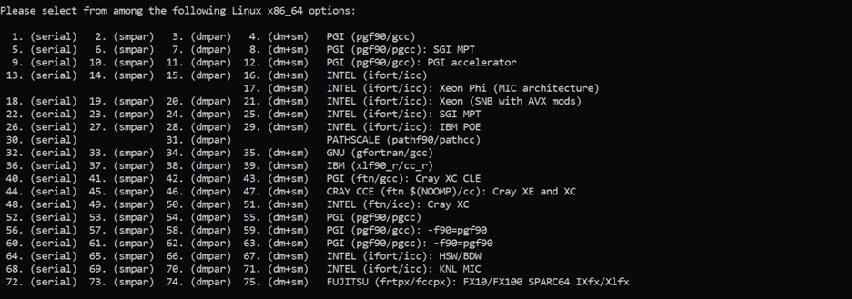

.. _compileLin:

================================
How to Compile WRF-Fire on Linux 
================================

The steps provided on this page have been successfully used to compile WRF-Fire with the following Operating System (OS) and compilers. Slight modifications may be needed for other  OS and compilers. 

.. raw:: html  

   
- OS: Ubuntu 20.04 LTS 

.. raw:: html  

   
- Fortran Compiler: Gfortran version 9.3.0  
 

.. raw:: html  

   
- C Compiler: GNU GCC version 9.3.0  

Ubuntu users can also compile and install WRF-Fire and its required libraries using the developed shell script described in **this page.**

Installing the Required Compilers and Libraries 
-----------------------------------------------

The first step in compiling WRF-Fire is to install the required compilers and libraries, and set up the environment properly.

Required Compilers and How to Install Them
------------------------------------------

Since WRF is mostly written in Fortran and partly in C++, both Fortran and C++ compilers are required. Available options include but are not limited to:

.. raw:: html

   
- <a href="https://gcc.gnu.org/wiki/GFortran" target="_blank">GNU Fortran</a> (Gfortran) compiler and <a href="https://gcc.gnu.org/" target="_blank">GNU Compiler Collection</a> (GCC)

.. raw:: html
        
   
- <a href="https://software.intel.com/content/www/us/en/develop/tools/oneapi/components/fortran-compiler.html" target="_blank"> Intel Fortran</a> (ifort) and <a href="https://software.intel.com/content/www/us/en/develop/tools/oneapi/components/dpc-compiler.html" target="_blank">Intel C++</a> (icc) compilers  

Gfortran and GCC compilers are highly recommended for beginners as they are free, and for debugging purposes as they catch errors better than the Intel compilers. However, for operational applications, Intel Fortran and C++ compilers are recommended.

.. note::
 
   WRF-Fire is not compatible with GCC version 10.

**For Ubuntu Users:** 
Ubuntu comes with GCC installed, and only Gfortran must be installed manually. To install Gfortran, it is recommended to use Advanced Package Tool (apt-get) for simplicity. Gfortran can be installed on Ubuntu using the following command:

::
   
    $ sudo apt-get install gfortran

Testing the Installed Compilers
-------------------------------

.. raw:: html

   Always test the installed compilers to ensure the proper installation and configuration. Compilers can be tested using basic codes like “Hello World!”, or using <a href="https://www2.mmm.ucar.edu/wrf/OnLineTutorial/compilation_tutorial.php" target="_blank">the test codes provided by NCAR.</a>

-----------------

Setting the Required Environment Variables (EVs)
------------------------------------------------

Before setting up the required Environment Variables, a directory should be created to install the required libraries. Then, the following Environment Variables must be set in the Shell’s Initialization File:

::
  
   export DIR= (Path to Libraries directory, e.g., /Users/username /LIBRARIES) 

   export CC=gcc 

   export CXX=g++ 

   export FC=gfortran 

   export FCFLAGS=-m64

   export F77=gfortran 

   export FFLAGS=-m64

   export JASPERLIB=$DIR/grib2/lib 

   export JASPERINC=$DIR/grib2/include 

   export LDFLAGS=-L$DIR/grib2/lib 

   export CPPFLAGS=-I$DIR/grib2/include

.. note::

   The ‘CC’, ‘CXX’, ‘FC’, and ‘F77’ Environment Variables are used to call the compilers, and therefore, they should be changed according to the compilers. For instance, the presented environment variables are for GFortran and GCC compilers in an Ubuntu system with only one version of the compilers installed.

**For Ubuntu Users:** The above-mentioned Environment Variables should be set in “.bash_profile” file since Ubuntu uses Bash shell. This file is located in the Home directory and can be accessed and edited using the following command: ::

   nano ~/.bash_profile

Required Libraries and How to Install Them
------------------------------------------

WRF-Fire requires several libraries to compile and run successfully. The required libraries are: 
 

.. raw:: html
   
   
- NetCDF: always required since WRF’s inputs and outputs are in NetCDF format  

.. raw:: html

   
- Mpich: required to compile and run WRF-Fire in parallel mode  

.. raw:: html
    
   
- Jasper: required for real-data cases  

.. raw:: html
    
   
- Zlib: required for real-data cases  

.. raw:: html
    
   
- Libpng: required for real-data cases  

.. note::
  
   All the required libraries should be compiled using the same compiler. Compiling the libraries with different compilers will cause errors when compiling the WRF-Fire itself.

**How to Install NetCDF**

In order to compile WRF-Fire, first install the NetCDF C and then the NetCDF Fortran libraries.
Steps to install NetCDF C library are as follows:

.. raw:: html   

   
 1. Download NetCDF C and Fortran libraries:

.. raw:: html    

    
- <a href="https://www.unidata.ucar.edu/downloads/netcdf/ftp/netcdf-c-4.8.0.tar.gz" target="_blank">NetCDF C</a> 

.. raw:: html    

   
- <a href="https://www.unidata.ucar.edu/downloads/netcdf/ftp/netcdf-fortran-4.5.3.tar.gz" target="_blank">NetCDF Fortran</a> 

2. Extract the downloaded NetCDF C library: 

::

   $ tar –xzvf (path to NetcCDF C tar archive)

3. Move to the extracted NetCDF C library:

::

   $ cd (path to NetCDF C extracted archive)

4. Configure NetCDF C using the following command:

::

   $ ./configure --prefix=$DIR/netcdf --disable-dap --disable-netcdf-4 --disable-shared

In this line, the “--prefix” command is used to specify the location to install the NetCDF library. Note that both NetCDF C and Fortran libraries must be installed in the same directory.
     
.. raw:: html

   
5. Issue “make” and “make install” commands:

::
     
   $ make 
   $ make install

Steps to install NetCDF Fortran library are similar to the steps presented for NetCDF C library, except that the steps should be done using the downloaded NetCDF Fortran archive. 

After installing both NetCDF C and Fortran libraries, the following two Environment Variables should be set using the method described in “Setting required Environment Variables (EVs)” section

::

   export PATH=$DIR/netcdf/bin:$PATH

   export NETCDF=$DIR/netcdf

**How to Install mpich**

The mpich library is required to compile and run WRF-Fire in parallel mode.
Steps to install mpich library are as follows:

.. raw:: html

   
1.  <a href="http://www.mpich.org/static/downloads/3.4.2/mpich-3.4.2.tar.gz" target="_blank"> Download mpich library </a>  

   
2. Extract the downloaded mpich library:
 
::

   $ tar –xzvf (path to mpich tar archive)

3. Move to the extracted mpich library:

::
      
   $ cd (path to mpich extracted archive)
 
4. Configure mpich using the following command:

::
 
   $ ./configure --prefix=$DIR/mpich

In this line, the “--prefix” command is used to specify the location to install the mpich library. 

5. Issue “make” and “make install” commands:

:: 

   $ make
   $ make install

After installing mpich, the following Environment Variable should be set using the method described in “Setting required Environment Variables (EVs)” section:

::

      export PATH=$DIR/mpich/bin:$PATH

**Testing NetCDF and mpich Libraries**

.. raw:: html

   In order to make sure that NetCDF and mpich libraries are installed and working properly, <a href= "https://www2.mmm.ucar.edu/wrf/OnLineTutorial/compilation_tutorial.php#STEP3" target="_blank">test codes provided by NCAR</a> can be used. It is highly recommended to test the libraries before compiling WRF-Fire to avoid any issues.  

-------------------------

**How to Install Jasper, Zlib, and Libpng**

Jasper, Zlib, and Libpng are only required to compile and run WRF-Fire in real-data cases. 
In order to install the above libraries, the following steps should be repeated for each library, and “library name” should be replaced by the name of the library being installed:

Download Jasper, Zlib, and Libpng libraries:

.. raw:: html  

   
- <a href="https://www.ece.uvic.ca/~frodo/jasper/software/jasper-2.0.14.tar.gz" target="_blank">Jasper</a>  

.. raw:: html  

   
- <a href="https://zlib.net/zlib-1.2.11.tar.gz" target="_blank">Zlib</a>  

.. raw:: html  

   
- <a href="http://prdownloads.sourceforge.net/libpng/libpng-1.6.37.tar.gz?download" target="_blank">Libpng</a> 

Extract the downloaded “library name” archive:

::

   $ tar –xzvf (path to (library name) tar archive)

Move to the extracted “library name” directory:

::

   $ cd (path to (library name) extracted archive)
  
Configure “library name” using the following command:

::
 
   $ ./configure  --prefix=$DIR/(library name)

In this line, the “--prefix” command is used to specify the location to install the “library name” library. 

Issue “make” and “make install” commands:

::
     
   $ make

   $ make install

Compiling WRF-Fire (Linux)
--------------------------

First make sure that all the required compilers and libraries are working properly and the required Environment Variables are set. Then proceed with compiling WRF-Fire.
WRF-Fire source files can be downloaded from its Github repository.

**Creating the Configuration file**

After extracting the source code, WRF configuration file should be created. In order to create the configuration file, the following command must be issued in the WRF’s source code directory:

::

   $ ./configure

Following this command, a list of options will appear and based on the installed compilers, the proper option should be selected. In these options, “serial” is to compile WRF in serial mode, and “dmpar” and “smpar” are to compile WRF in parallel mode using Distributed Memory Parallel (MPI) and Symmetric Multi-Processing/Shared Memory Parallel (OpenMP), respectively. For instance, GNU and Gfortran users should select option 32 or 34 to compile WRF-Fire in Serial or MPI mode, respectively.

  
.. centered:: Available options to compile WRF-Fire in Linux Environment

After choosing the proper option from the list, nesting preferences should be selected. For WRF-Fire, nesting option “1=basic” must be used.

**Compiling WRF-Fire**

.. raw:: html

   After creating the configuration file, WRF-Fire can be compiled for idealized and real-data cases using the following commands:  

-------------------------

For idealized cases:

::

   $ ./compile em_fire  >& log.compile

For real data cases:

::

   $ ./compile em_real  >& log.compile

.. raw:: html
  
   Compilation log will be written in “log.compile” file, which can be checked to track errors in unsuccessful compilations.  

-------------------

WRF-Fire is compiled using 2 CPUs by default. To change the number of CPUs used for compilation, “-j (no. of CPUs)” flag can be used. For example, the following command can be used to compile WRF-Fire using 9 CPUs for idealized cases:

::

   $ ./compile -j 9 em_fire  >& log.compile

**How to Check the Compilation Success**

After successful compilation, the following “.exe” files should be generated in “(path to WRF directory)/test/(case name)” directory, where “case name” is “em_fire” and “em_real” for idealized and real data cases, respectively:

For idealized cases: 

.. raw:: html

   
- ideal.exe

.. raw:: html

   
- wrf.exe

For real cases:

.. raw:: html

   
- real.exe

.. raw:: html

   
- ndown.exe

.. raw:: html

   
- tc.exe

.. raw:: html

   
- wrf.exe

To check whether these files are generated, the following command can be used::

$ ls -ls (path to WRF directory)/test/(case name)/*.exe

