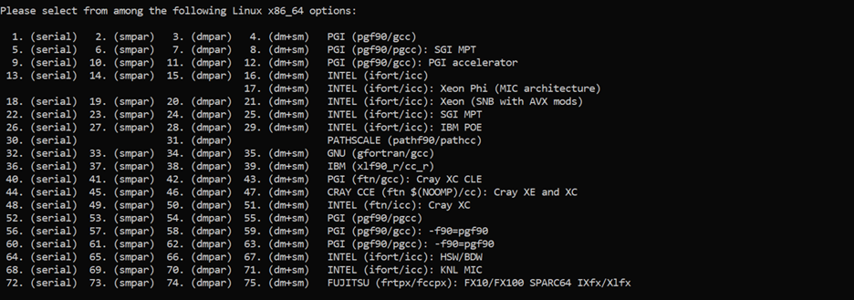
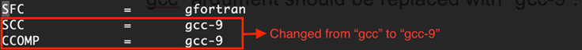

.. _compileMac:

How to Compile WRF-Fire on Mac
============================== 
The steps provided on this page have been successfully used to compile WRF-Fire with the following Operating System (OS) and compilers. Slight modifications may be needed for other  versions of Mac OS and compilers.    

.. raw:: html  

   
- OS: Mac OS Catalina 10.15 and Mac OS Big Sur 11.2  

.. raw:: html  

   
- Fortran compiler: Gfortran version 9.2.0  

.. raw:: html   

   
- C compiler: GNU GCC version 9.3.0  

Installing Required Compilers and Libraries
-------------------------------------------

The first step in compiling WRF-Fire is to install the required compilers and libraries, and set up the environment properly.

.. _runwrf:

Required Compilers and How to Install Them
------------------------------------------

Since WRF is mostly written in Fortran and partly in C++, both Fortran and C++ compilers are required. Available options include but are not limited to:
      
.. raw:: html  
 
     
- <a href="https://gcc.gnu.org/wiki/GFortran" target="_blank">GNU Fortran</a> (Gfortran) compiler and <a href="https://gcc.gnu.org/wiki/GFortran" target="_blank"> GNU Compiler Collection</a> (GCC)

.. raw:: html  
 
     
- <a href="https://software.intel.com/content/www/us/en/develop/tools/oneapi/components/fortran-compiler.html" target="_blank">Intel Fortran</a> (ifort) and <a href="https://software.intel.com/content/www/us/en/develop/tools/oneapi/components/dpc-compiler.html" target="_blank"> Intel C++</a> (icc) compilers

Gfortran and GCC compilers are highly recommended for beginners as they are free, and for debugging purposes as they catch errors better than the Intel compilers. However, for operational applications, Intel Fortran and C++ compilers are recommended.

.. note::

   WRF-Fire is not compatible with GCC version 10.

Steps to install the required compilers on Mac OS are as follows:

.. raw:: html

   
1. Install Xcode from <a href="https://apps.apple.com/us/app/xcode/id497799835?mt=12" target="_blank">App Store</a> 

.. raw:: html

   
2. Install Command Line Tools using the following command:

::

      $ xcode-select –install

.. raw:: html

   
3. Install required compilers

.. note::
  
   WRF-Fire is not compatible with Apple LLVM compiler installed with Xcode, and the aforementioned compilers should be installed manually. Using Homebrew is highly recommended to install the required compilers. For instance, GCC version 9 can be installed from Homebrew using the following command::
   
   $ brew install gcc-9

Testing the Compilers
---------------------
.. raw:: html
   
   Always test the installed compilers to ensure the proper installation and configuration. Compilers can be tested using basic codes like “Hello World!”, or using <a href="https://www2.mmm.ucar.edu/wrf/OnLineTutorial/compilation_tutorial.php" target="_blank">the test codes provided by NCAR</a>.

----------------

Setting Required Environment Variables (EVs)
--------------------------------------------
Before setting up the required Environment Variables, a directory should be created to install the required libraries. Then, the following Environment Variables must be set in the Shell’s Initialization File::

   export DIR= (Path to Libraries directory, e.g., /Users/username /LIBRARIES)
   export CC=gcc-9
   export CXX=g++-9
   export FC=gfortran
   export FCFLAGS=-m64
   export F77=gfortran
   export FFLAGS=-m64
   export JASPERLIB=$DIR/grib2/lib
   export JASPERINC=$DIR/grib2/include
   export LDFLAGS=-L$DIR/grib2/lib
   export CPPFLAGS=-I$DIR/grib2/include

.. note:: 
  
   The **‘CC’**, **‘CXX’**, **‘FC’**, and **‘F77’** Environment Variables are used to call the compilers, and therefore, they should be changed according to the compilers. For instance, the presented environment variables are for GFortran and GCC version 9 compilers installed via Homebrew. In order to find the correct commands for installed compilers, check Hombrew’s documentation or the source from which the compilers are being installed.

.. note:: 

   Setting aliases to call the compilers will not work, and only the original calling command must be used to compile WRF and libraries successfully.

Mac OS Catalina 10.15 and later uses ZSH shell as the default shell. In ZSH shell, the above-mentioned Environment Variables should be set in “.zprofile” file. This file is located in the Home directory and can be accessed and edited using the following command::

   $ nano ~/.zprofile

Required Libraries and How to Install Them
------------------------------------------

WRF-Fire requires several libraries to compile and run successfully. The required libraries are:

.. raw:: html
   
   
- NetCDF: always required since WRF’s inputs and outputs are in NetCDF format  

.. raw:: html

   
- Mpich: required to compile and run WRF-Fire in parallel mode  

.. raw:: html
    
   
- Jasper: required for real-data cases  

.. raw:: html
    
   
- Zlib: required for real-data cases  

.. raw:: html
    
   
- Libpng: required for real-data cases  

.. note:: 

   All the required libraries should be compiled using the same compiler. Compiling the libraries with different compilers will cause errors when compiling the WRF-Fire itself.

**How to Install NetCDF**

In order to compile WRF-Fire, first intall the NetCDF C and then the NetCDF Fortran libraries. 

Steps to install netCDF C library are as follows:

.. raw:: html  

   
1. Download NetCDF C and Fortran libraries:

.. raw:: html  
 
     
- <a href="https://www.unidata.ucar.edu/downloads/netcdf/ftp/netcdf-c-4.8.0.tar.gz" target="_blank">     NetCDF C</a>  

.. raw:: html  
 
     
- <a href="https://www.unidata.ucar.edu/downloads/netcdf/ftp/netcdf-fortran-4.5.3.tar.gz" target="_blank">     NetCDF Fortran</a>

.. raw:: html

   
2. Extract the downloaded NetCDF C library:

::

   $ tar –xzvf (path to NetCDF C tar archive)

.. raw:: html

   
3. Move to the extracted NetCDF C library:

::

   $ cd (path to NetCDF C extracted archive) 

.. raw:: html

   
4. Configure the NetCDF C using the following command:

::

   $ ./configure --prefix=$DIR/netcdf --disable-dap --disable-netcdf-4 --disable-shared

.. raw:: html

   In this line, “--prefix” command is used to specify the location to install the NetCDF library. Note that both NetCDF C and Fortran libraries must be installed in the same directory.   

.. raw:: html

   
5. Issue “make” and “make install” commands::

   $ make
   $ make install

Steps to install NetCDF Fortran library are similar to the steps presented for NetCDF C library, except that the steps should be done using the downloaded NetCDF Fortran archive. 

After installing both NetCDF C and Fortran libraries, the following two Environment Variables should be set using the method described in “Setting required Environment Variables (EVs)” section::

   export PATH=$DIR/netcdf/bin:$PATH
   
   export NETCDF=$DIR/netcdf

**How to Install mpich**

The mpich library is required to compile and run WRF-Fire in parallel mode.
Steps to install mpich library are as follows:

.. raw:: html

   
1. <a href="http://www.mpich.org/static/downloads/3.4.2/mpich-3.4.2.tar.gz" target="_blank"> Download mpich </a>library 

.. raw:: html

   
2. Extract the downloaded mpich library 

::

   $ tar –xzvf (path to mpich tar archive)

.. raw:: html

   
3. Move to the extracted mpich library  

::

      $ cd (path to mpich extracted archive)

.. raw:: html

   
4. Configure mpich using the following command  

::

      $ ./configure --prefix=$DIR/mpich

.. raw:: html

   In this line, “--prefix” command is used to specify the location to install the mpich library.  

.. raw:: html

    
5. Issue “make” and “make install” commands  

::

      $ make
      $ make install

After installing mpich, the following Environment Variable should be set using the method described in “Setting required Environment Variables (EVs)” section::

   export PATH=$DIR/mpich/bin:$PATH

**Testing NetCDF and mpich Libraries**

.. raw:: html

   In order to make sure that NetCDF and mpich libraries are installed and working properly, <a href="https://www2.mmm.ucar.edu/wrf/OnLineTutorial/compilation_tutorial.php" target="_blank">test codes provided by NCAR </a>can be used. It is highly recommended to test the libraries before compiling WRF-Fire to avoid any issues.

--------------------

**How to Install Jasper, Zlib, and Libpng**

Jasper, Zlib, and Libpng are only required to compile and run WRF-Fire in real-data cases. 
In order to install the above libraries, the following steps should be repeated for each library, and “library name” should be replaced by the name of the library being installed:

.. raw:: html

   
1. Download Jasper, Zlib, and Libpng libraries: 

.. raw:: html  

   
- <a href="https://www.ece.uvic.ca/~frodo/jasper/software/jasper-2.0.14.tar.gz" target="_blank">Jasper</a>    

.. raw:: html  
 
   
- <a href="https://zlib.net/zlib-1.2.11.tar.gz" target="_blank">Zlib</a>  

.. raw:: html  
 
   
- <a href="http://prdownloads.sourceforge.net/libpng/libpng-1.6.37.tar.gz?download" target="_blank">Libpng</a>  

.. raw:: html

   
2. Extract the downloaded “library name” archive:

::

   $ tar –xzvf (path to (library name) tar archive)

.. raw:: html
   
   
3. Move to the extracted “library name” directory:

::

   $ cd (path to (library name) extracted archive)

.. raw:: html

   
4. Configure “library name” using the following command:

::

   $ ./configure  --prefix=$DIR/(library name)

.. raw:: html

   In this line, “--prefix” command is used to specify the location to install the “library name” library.  

.. raw:: html

    
5. Issue “make” and “make install” commands:

::
   
   $ make
   $ make install

Compiling WRF-Fire (Mac)
------------------------

First make sure that all the required compilers and libraries are working properly, and the required Environment Variables are set. Then proceed with compiling WRF-Fire.

.. raw:: html

   WRF-Fire source can be downloaded from its <a href="https://github.com/wrf-model/WRF" target="_blank">Github </a>repository.  

------------------

| **Creating the Configuration File**
| After extracting the source code, WRF configuration file should be created. In order to create the configuration file, the following command must be issued in the WRF’s source code directory:

::

   $ ./configure

Following this command, a list of options will appear and based on the installed compilers, the proper option should be selected. In these options, “serial” is to compile WRF in serial mode, and “dmpar” and “smpar” are to compile WRF in parallel mode using Distributed Memory Parallel (MPI) and Symmetric Multi-Processing/Shared Memory Parallel (OpenMP), respectively. For instance, GNU and Gfortran users should select option 15 or 17 to compile WRF-Fire in Serial or MPI mode, respectively.

.. centered:: Available options to compile WRF-Fire in Mac Environment 
 
After choosing the proper option from the list, nesting preferences should be selected. For WRF-Fire, nesting option “1=basic” must be used.
Mac users should also modify the configuration file and set the correct compiler calling commands to successfully compile WRF-Fire. This file is called “configure.wrf”, and it is located in the WRF’s source code directory. 

.. centered:: Correcting compilers calling command in “configure.wrf” file

**Compiling WRF-Fire**

After creating the configuration file, WRF-Fire can be compiled for idealized and real-data cases using the following commands:

.. raw:: html

   
 - For idealized cases:

::

   $ ./compile em_fire  >& log.compile

.. raw:: html

   
 - For real data cases:

::

   $ ./compile em_real  >& log.compile

Compilation log will be written in “log.compile” file, which can be checked to track errors in unsuccessful compilations.
WRF-Fire is compiled using 2 CPUs by default. To change the number of CPUs used for compilation, “-j (no. of CPUs)” flag can be used. For example, the following command can be used to compile WRF-Fire using 9 CPUs for idealized cases::

   $ ./compile -j 9 em_fire  >& log.compile

**How to Check the Compilation Success**

.. raw:: html

   After successful compilation, the following “.exe” files should be generated in “(path to WRF directory)/test/(case name)” directory, where “case name” is “em_fire” and “em_real” for idealized and real data cases, respectively:  

.. raw:: html

    
 - For idealized cases: 

.. raw:: html

   
- ideal.exe 

.. raw:: html

   
- wrf.exe  

.. raw:: html

   
 - For real cases:

.. raw:: html

   
- real.exe 

.. raw:: html

   
- ndown.exe 

.. raw:: html

   
- tc.exe 

.. raw:: html

   
- wrf.exe 

To check whether these files are generated, the following command can be used::
 
  $ ls -ls (path to WRF directory)/test/(case name)/*.exe
