=============
Case Studies
=============

.. _case1:

Case Study 1: Idealized Flat-surface Uncoupled Model
----------------------------------------------------

The first case study presented here is an idealized uncoupled model with flat surface based on the first model presented by Munoz-esparza et al. [1].  The wind field is assumed to be uniform and constant throughout the simulation, and all the atmospheric options are turned off in this case. The main goal of this case is to introduce the very basics of WRF and WRF-Fire, and how to create an idealized model. As an uncoupled model, this case only represents Rothermel’s [2]rate of spread (ROS) theorem.

.. _c1IF

Input Files
^^^^^^^^^^^

In idealized cases, WRF-Fire requires three input files:

1. namelist.input: this file contains all of the WRF and WRF-Fire modelling parameters and assumptions

2. namelist.fire: fuel characteristics for different fuel types are defined in this file

3. Input_sounding: the atmospheric state including wind components along X and Y direction, temperature, and water vapor mixing ratio along the vertical axis is specified in this input file

.. Note:: The input files are text files which can be generated/edited using text editors such as Notepad and Sublime Text.

**Hint:** The best way to generate the input files is to use sample inputs such as hill_simple and two_fires, and modify them as required.

Namelist.input
^^^^^^^^^^^^^^

All the modelling parameters and assumptions for both WRF atmospheric model and WRF-Fire is defined in “namelist.input” file. This input file contains different sections controlling different aspects of the model such as control, domains setup, physics schemes, and fire module.

General Structure
^^^^^^^^^^^^^^^^^

The general structure of the “namelist.input” file is as follows.

:: 

     &(section name)
     .
     .
     .
     (options within this section)
     .
     .
     .
     /
     
.. Note:: comments can be defined using a “!”.

The options activated in each section for this case study are presented in this section.

&time_control
^^^^^^^^^^^^^

The temporal setup of the model, such as simulation duration, simulation date and time, and outputs interval, is controlled by this section. The options and values used for this case study is shown below.

::

    &time_control
    run_days                            = 0,
    run_hours                           = 1,
    run_minutes                         = 0,
    run_seconds                         = 0,
    start_year                          = 0001,
    start_month                         = 01,
    start_day                           = 01,
    start_hour                          = 00,
    start_minute                        = 00,
    start_second                        = 00,
    end_year                            = 0001,
    end_month                           = 01,
    end_day                             = 01,
    end_hour                            = 1,
    end_minute                          = 00,
    end_second                          = 00,
    history_interval_s                  = 120,
    frames_per_outfile                  = 1,
    restart                             = .false.,
    !restart_interval                    = 30,
    io_form_history                     = 2,
    io_form_restart                     = 2,
    io_form_input                       = 2,
    io_form_boundary                    = 2,
    /

Most of the options in this section are self-explanatory. In this case study, the model will be running for 1 hour (see options “run_days”, “run_hours”, etc.). The simulation start and end date and time are not important in most of the idealized cases, and therefore, the date is set to all 1 and the time is from 0 to 1 hour.  Options “history_interval_s” and “frames_per_outfile” specify the output interval in seconds and the number of outputs per output file, respectively. For instance, these options are set to 120 and 1 in this case meaning WRF-Fire will generate outputs each 120 seconds and writes each output interval on a separate file. The options beginning with “io” defines the input/output file format, and option 2 used herein is for “NetCDF” format which is the typically used format in WRF and WRF-Fire.

&domains
^^^^^^^^

This section controls domain setup of the model which includes number of domains, domains sizes, domains starting and ending points, grid size, and time step. The domain setup of this case is as follows.

::

    &domains
    time_step                           = 0,
    time_step_fract_num                 = 1,
    time_step_fract_den                 = 4,
    max_dom                             = 1,
    s_we                                = 1,
    e_we                                = 51,
    s_sn                                = 1,
    e_sn                                = 51,
    s_vert                              = 1,
    e_vert                              = 101,
    dx                                  = 100.00,
    dy                                  = 100.00,
    ztop                                = 2000,
    grid_id                             = 1,
    parent_id                           = 0,
    i_parent_start                      = 0,
    j_parent_start                      = 0,
    parent_grid_ratio                   = 1,
    parent_time_step_ratio              = 1,
    sr_x                                = 4,
    sr_y                                = 4,
    /
    
“time_step” defines the model time step in seconds, and “time_step_fract_num” and “time_step_fract_den” specify the nominator and denominator of the fractional part of the time step in seconds, respectively. “max_dom” specifies the number of domains, and options starting with “s_” and “e_” are used to define the domain start and end point in west-east (we), south-north (sn), and vertical (vert) directions. Grid sizes in X and Y direction are defined using “dx” and “dy” in meters, and the model top is set to 2000 meters using “ztop” option. “grid_id” and “parent_id” options define the domain number and the its respective parent domain number. In this case, for instance, since the model only has one domain, the domain number is set to 1 and its parent number is 0 meaning that this is the outermost domain. “i_parent_start” and “j_parent_start” which specify the starting grid point of the domain within its parent domain are also set to zero in this case as it is a single domain model. “sr_x” and “sr_y” options defines the fire domain refining, and in this case, they are 4 resulting in a fire domain 4 times finer than the main atmospheric domain.

&physics
^^^^^^^^

Physics section is used to activate physics schemes of WRF atmospheric model. Since in this case the goal is to represent Rothermel’s ROS equation, i.e., the model is uncoupled with uniform wind field, all the physics options are turned off as shown below.

::

    &physics
    mp_physics                          = 0,
    ra_lw_physics                       = 0,
    ra_sw_physics                       = 0,
    sf_sfclay_physics                   = 0,
    sf_surface_physics                  = 0,
    bl_pbl_physics                      = 0,
    bldt                                = 0,
    cu_physics                          = 0,
    cudt                                = 0,
    isfflx                              = 0,
    ifsnow                              = 0,
    icloud                              = 0,
    mp_zero_out                         = 0,
    /

&dynamics
^^^^^^^^^

Dynamics section controls the parametrization schemes of WRF atmospheric model. This model uses WRF classic terrain-following vertical grid instead of a hybrid terrain-following and isobaric grid. This setup is indicated by turning off “hybrid_opt” option. The temporal discretization of the model is set to 3rd order Runge-Kutta scheme using “rk_ord” option which defines the order of the Runge-Kutta scheme. Diffusion options, “diff_opt” and “km_opt”, are turned off as we want to achieve a uniform constant wind field. Furthermore, surface drag and heat flux, “tke_drag_coefficient” and “tke_heat_flux”, are set to zero to create an idealized slip-free surface that will not affect the wind field. WRF atmospheric model of this case is ran non-hydrostatically by setting “non_hydrostatic” option to true. Horizontal momentum and scalar advection order is default 5, and vertical momentum and advection order is default 3. “time_step_sound” which defines the ratio of model time step to sounding time step is set to 20 in this case. Moisture and scalar advection, “moist_adv_opt” and “scalar_adv_opt”, are the default positive-definite scheme. The tracer option, “tracer_opt”, is set to 3 which is the value must be used for WRF-Fire simulations. This variable activates tracers in WRF atmospheric model to simulate smoke dispersion from fire. 

::

     &dynamics
     hybrid_opt                          = 0,
     rk_ord                              = 3,
     diff_opt                            = 0,
     km_opt                              = 0,
     tke_drag_coefficient                = 0.0,
     tke_heat_flux                       = 0.0,
     non_hydrostatic                     = .true.,
     h_mom_adv_order                     = 5,
     v_mom_adv_order                     = 3,
     h_sca_adv_order                     = 5,
     v_sca_adv_order                     = 3,
     time_step_sound                     = 20,
     moist_adv_opt                       = 1,
     scalar_adv_opt                      = 1,
     tracer_opt                          = 3,
     /

&bdy_control
^^^^^^^^^^^^

This section specifies the atmospheric model’s boundary condition. Multiple options are available in idealized cases, and they are described in WRF Technical Note Chapter 6. For this case, the periodic boundary condition is activated.

::

     &bdy_control
     periodic_x                          = .true.,
     symmetric_xs                        = .false.,
     symmetric_xe                        = .false.,
     open_xs                             = .false.,
     open_xe                             = .false.,
     periodic_y                          = .true.,
     symmetric_ys                        = .false.,
     symmetric_ye                        = .false.,
     open_ys                             = .false.,
     open_ye                             = .false.,
     /
     
&namelist_quilt
^^^^^^^^^^^^^^^

The options within this section allow for reserving several CPU cores to manage output only. These options are useful when the domain is large, but in this simple case reserved CPU cores (“nio_tasks_per_group”) is set to zero.

::

    &namelist_quilt
    nio_tasks_per_group = 0,
    nio_groups = 1,
    /
    
&fire
^^^^^

To this point, all the previous sections were for setting up the WRF atmospheric model. This section includes the setting required for WRF-Fire fire spread platform. For the purpose of the tutorial, the options within “&fire” is divided into multiple sub-sections as follows.
::

    ifire              = 2,
    fire_fuel_read     = 0,
    fire_fuel_cat      = 1, 

“ifire” is used to activate or disactivate WRF-Fire. The available options are 0 and 2 which turns WRF-Fire off and on, respectively. By setting “fire_fuel_read” to 0, the model is configured to use a uniform fuel type defined by the user in “namelist.fire” file. Other choices for this option will be investigated in real data cases. “fire_fuel_cat” specifies the fuel category to be used in the simulation from “namelist.fire” input file. To illustrate, in this example, the fuel category is set to 1 meaning that WRF-Fire will use fuel category 1 from “namelist.fire” input file.

::

    fire_num_ignitions     = 1,
    fire_ignition_start_x1 = 1050., 
    fire_ignition_start_y1 = 2000., 
    fire_ignition_end_x1   = 1050., 
    fire_ignition_end_y1   = 3000.,
    fire_ignition_ros1 =   110,
    fire_ignition_radius1  = 100, 
    fire_ignition_start_time1 = 10, 
    fire_ignition_end_time1  = 11, 
    
The above set of options are used to define fire ignition characteristics. WRF-Fire supports for up to 5 ignition lines, and the number of ignition lines is defined using “fire_num_ignition” which is 1 in this case. The next four options specify the X and Y coordinates of ignition line start and end points in meters from the lower left corner of the domain. “fire_ignition_ros1” and “fire_ignition_radius1” specify the ignition line ROS during the ignition and ignition line radius, width in other words, respectively. The last two options define the ignition start and end time from the beginning of the simulation in seconds.

.. Note:: the number 1 at the end of the above-mentioned ignition line characteristics indicates the ignition line number. Therefore, if 2 ignition lines are desired, all the above options must be repeated with the difference that the end number must be changed to 2. For instance, the ignition ROS of the ignition line 2 is “fire_ignition_ros2”.

.. Note:: one of the known issues of WRF-Fire is that the fire does not ignite or ignites with a delay under special circumstances. In order to ensure fire ignition, the below equation must be satisfied:

.. centered:: lfn\ :sub:`new`\ =d -min⁡(radius, ROS* (end\ :sub:`ts`\ - time\ :sub:`ign`\)<0

Where, d is the distance from ignition line to the nearest fire grid point, radius is ignition line radius, ROS is ignition rate of spread, and time\ :sub:`ign`\  and end\ :sub:`ts`\  is ignition start and end time, respectively. 

::

    fire_print_msg     = 1,
    fire_wind_height = 6.5, 
    fire_topo_from_atm = 1,
    fire_atm_feedback = 0.0,
    fire_viscosity = 0.4, 
    fire_upwinding = 7,
    fire_boundary_guard=-1,

The first option, “fire_print_msg”, controls the output from WRF-Fire written on the standard output. Option 1 used in this case prints the basic information of fire module such as mean and maximum wind speed, area burned, and model time. “fire_wind_height” controls the height at which the wind components are calculated for Rothermel’s ROS equation which is typically 6.5 meters same as in this case. As mentioned earlier, this case is an uncoupled model meaning that the fire/atmosphere interaction is turned off. This is defined by “fire_atm_feedback” which is set to zero. “fire_viscosity” and “fire_upwinding” determine the artificial viscosity required for the level-set equation and the spatial discretization of the level-set differential equation, respectively. “fire_upwinding” 7 is for WENO5 scheme [3]. Lastly, the “fire_boundary_guard” specifies the number of cells from the domain boundary to stop the fire when it reaches that cell.

The “&fire” section of this case study is as follows.

::

    &fire
    ifire              = 2,
    fire_fuel_read     = 0,
    fire_fuel_cat      = 1, 
    fire_num_ignitions     = 1,
    fire_ignition_start_x1 = 1050., 
    fire_ignition_start_y1 = 2000., 
    fire_ignition_end_x1   = 1050., 
    fire_ignition_end_y1   = 3000.,
    fire_ignition_ros1 =   110,
    fire_ignition_radius1  = 100, 
    fire_ignition_start_time1 = 10, 
    fire_ignition_end_time1  = 11, 
    fire_print_msg     = 1,
    fire_wind_height = 6.5, 
    fire_topo_from_atm = 1,
    fire_atm_feedback = 0.0,
    fire_viscosity = 0.4, 
    fire_upwinding = 7,
    fire_boundary_guard=-1,
     /

Namelist.fire
^^^^^^^^^^^^^

The fuel characteristics required in Rothermel’s equation, such as fuel load, fuel height, surface area to volume ratio, and fuel moisture content, are specified in this file. Sample “namelist.fire” files provided with WRF-Fire (located at test/em_fire directory) are based on Anderson’s 13 fuel category [4], and they can be modified using a text editor.  Moreover, the general structure of this file is same as the “namelist.input’ file. Available sections and options in this file are described in the rest of this section. 

.. Note:: same as “namelist.input”, modifying one of the sample files is highly recommended. 

&fuel_scalars
^^^^^^^^^^^^^

This section includes the fuel characteristics that are constant among all the fuel types. “&fuel_scalars” parameters used for this case study is based on Rothermel’s model and Anderson’s 13 fuel categories, and they are as follows.

::

    &fuel_scalars                    
    cmbcnst  = 17.433e+06,             
    hfgl     = 17.e4 ,             
    fuelmc_g = 0.08,                  
    fuelmc_c = 1.00,              
    nfuelcats = 13,                    
    no_fuel_cat = 14                 
    /
    
In the above parameters, the “cmbcnst” and “hfgl” parameters define combustion heat of dry fuel in J kg-1 and heat flux to ignite canopy in W m-2, respectively. The “fuelmc_g” and “fuelmc_c” specify the fuel moisture content of surface (ground) and canopy fuel, respectively. The total number of fuel categories are set to 13 using “nfuelcats” option, and non-burnable fuel is assigned fuel category 14 using “no_fuel_cat” option meaning that pixels defined with fuel category 14 will be considered as non-burnable, and they will not burn during the simulation.

&fuel_categories
^^^^^^^^^^^^^^^^

Fuel characteristics for each fuel type are defined in this section. In the following “&fuel_categories” used for this case study, “windrf” is the wind adjustment factor which calculates the wind at mid-flame length from the wind speed at 6.5 meters. “fgi” and “fueldepthm” are used to specify the total fuel load in kg m-2 and fuel depth in meters for each fuel type, respectively. Fuel particle surface-area to volume ratio is defined in m-1 using “savr” parameter, and fuel moisture content of extinction is defined using “fuelmce” parameter. “fueldense” specifies the fuel particle density, which is 32 kg m-1 for solid and 19 kg m-1 for rotten fuels. “st” and “se” parameters specify fuel particle total and effective mineral content, respectively. “weight” parameter specifies the weighting factor used to calculate the heat flux from fire. 

::

    &fuel_categories                 
    windrf= 0.36, 0.36, 0.44,  0.55,  0.42,  0.44,  0.44, 0.36, 0.36, 0.36,  0.36,  0.43,  0.46, 1e-7
    fgi =  0.166, 0.897, 0.675, 2.468, 0.785, 1.345, 1.092, 1.121, 0.780, 2.694, 2.582, 7.749, 13.024, 1.e-7, 
    fueldepthm=0.305, 0.305, 0.762, 1.829, 0.61,  0.762, 0.762, 0.061, 0.061, 0.305, 0.305, 0.701, 0.914, 0.305,
    savr = 3500., 2784., 1500., 1739., 1683., 1564., 1562., 1889., 2484., 1764., 1182., 1145., 1159., 3500.,
    fuelmce = 0.12, 0.15, 0.25, 0.20, 0.20, 0.25, 0.40, 0.30, 0.25, 0.25, 0.15, 0.20, 0.25, 0.12,  
    fueldens = 32.,32.,32.,32.,32.,32.,32.,32.,32.,32.,32.,32.,32.,32.,
    st = 0.0555, 0.0555, 0.0555, 0.0555, 0.0555, 0.0555, 0.0555, 0.0555, 0.0555, 0.0555, 0.0555, 0.0555, 0.0555, 0.0555,
    se = 0.010, 0.010, 0.010, 0.010, 0.010, 0.010, 0.010, 0.010, 0.010, 0.010, 0.010, 0.010, 0.010, 0.010, 
    weight = 7.,  7.,  7., 180., 100., 100., 100., 900., 900., 900., 900., 900., 900., 7. ,
    /
    
Input_sounding
^^^^^^^^^^^^^^
The initial atmosphere state of the WRF atmospheric model is defined by “input_sounding” file. Same as other input files, this is also text file which can be edited using any text editors. The structure of “input_sounding” is as follows.
The first row of the “input_sounding” determines the surface characteristics as demonstrated in the following table.

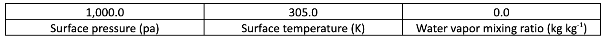

The other rows of the “input_sounding” file specify the atmosphere state at different elevations. The structure of these rows is demonstrated in the following table.

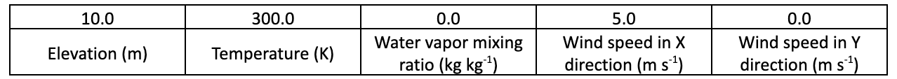

The complete “input_sounding” used for this study is as follows.

::

    1000	305	0.0
    1.0	300	0.0	5.0	0
    6.0	300	0.0	5.0	0
    9.1	300	0.0        5.0	0
    18.3	300	0.0        5.0	0
    18.35	300	0.0	5.0	0
    91.2	300	0.0	5.0	0
    100	300	0.0	5.0	0
    200	300	0.0	5.0	0
    300	300	0.0	5.0	0
    400	300	0.0	5.0	0
    500	300	0.0	5.0	0
    600	300	0.0	5.0	0
    700	300	0.0	5.0	0
    800	300	0.0	5.0	0
    900	300	0.0	5.0	0
    1000	300	0.0	5.0	0
    1100	301	0.0	5.0	0
    1200	302	0.0	5.0	0
    1300	303	0.0	5.0	0
    1400	304	0.0	5.0	0
    1500	305	0.0	5.0	0
    1600	306	0.0	5.0	0
    1700	307	0.0	5.0	0
    1800	308	0.0	5.0	0
    1900	309	0.0	5.0	0
    2000	310	0.0	5.0	0
    2100	311	0.0	5.0	0
    
In this case study, the surface is assumed to be at 1,000 pa pressure level, and water vapor mixing ratio is assumed to be zero. The wind speed is uniform 5 m s-1 along the X direction. The surface temperature is set to 305 K. The temperature is assumed to be constant 300 K till 1 km altitude, and it increases linearly to 311 K from 1 to 2.1 km.

.. Note:: the elevations specified in “input_sounding” do not need to match the WRF vertical levels. WRF interpolates the parameters from “input_sounding to model levels.

Sample Output
^^^^^^^^^^^^^

Sample outputs of this case study is shown in the below figures. These figures are generated using the in-house Python code to plot fire perimeter, topography, and wind field in idealized simulations. The mentioned Python code along with its description is available in :ref:`this<python>` page.
This model results are purely Rothermel’s ROS theorem as the fire/atmosphere coupling is turned off and the wind field is constant during the simulation. The “U” shape of the fire propagation, which is the well-known fire shape driven by wind, is clearly present in the results, and the fire is propagating along the wind direction indicating that the results are correct. Moreover, fire ROS is constant throughout the simulation, and it is equal to value resulted by Rothermel’s ROS equation for fuel type 1, short grass, under no topography and 5 ms\ :sup:`-1`\  wind speed.

Beginning of the simulation
^^^^^^^^^^^^^^^^^^^^^^^^^^^
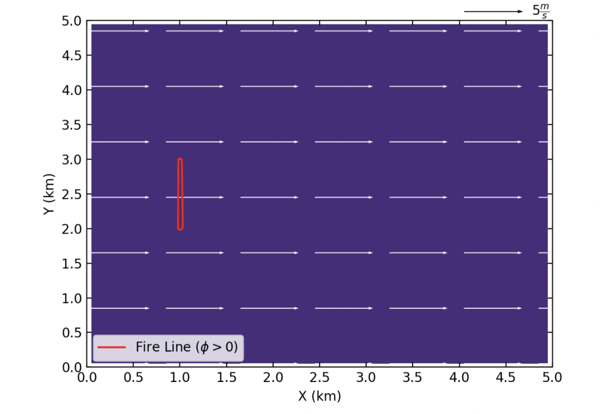

10 min after start of the simulation 
^^^^^^^^^^^^^^^^^^^^^^^^^^^^^^^^^^^^
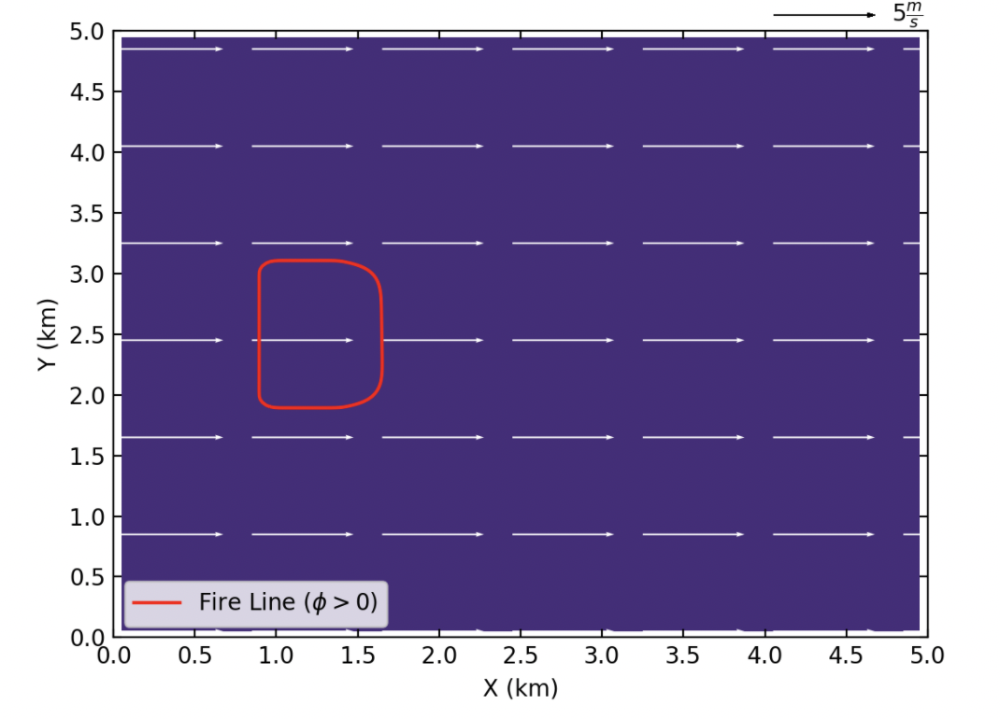

20 min after start of the simulation
^^^^^^^^^^^^^^^^^^^^^^^^^^^^^^^^^^^^
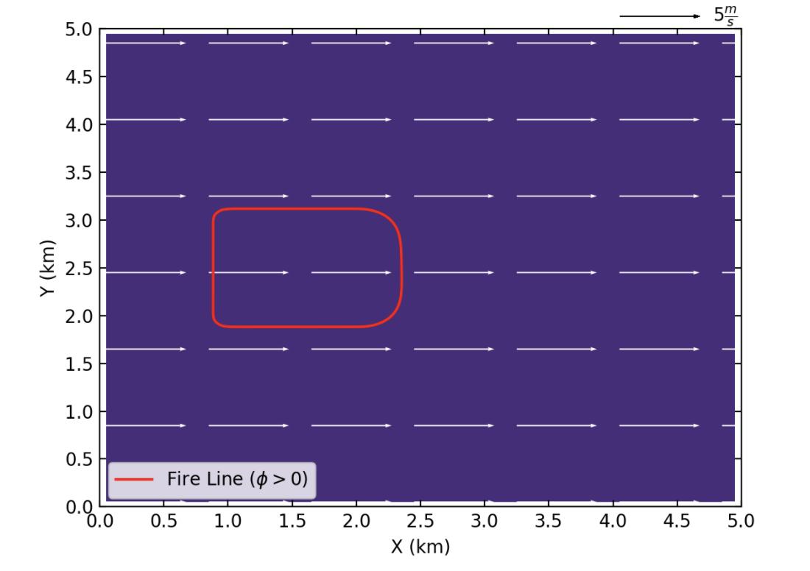

End of the simulation 
^^^^^^^^^^^^^^^^^^^^^
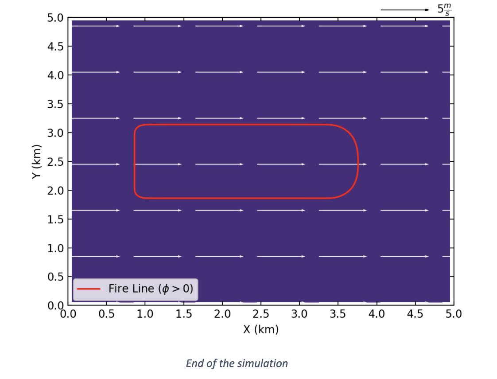
  
  
References

[1]	D. Muñoz-Esparza, B. Kosović, P. A. Jiménez, and J. L. Coen, “An Accurate Fire-Spread Algorithm in the Weather Research and Forecasting Model Using the Level-Set Method,” J. Adv. Model. Earth Syst., vol. 10, no. 4, pp. 908–926, Apr. 2018, doi: 10.1002/2017MS001108.

[2]	R. C. Rothermel, A mathematical model for predicting fire spread in wildland fuels. Intermountain Forest & Range Experiment Station, Forest Service, U.S. Dept. of Agriculture, 1972.

[3]	P. A. Jiménez, D. Muñoz-Esparza, and B. Kosović, “A High Resolution Coupled Fire–Atmosphere Forecasting System to Minimize the Impacts of Wildland Fires: Applications to the Chimney Tops II Wildland Event,” Atmos. 2018, Vol. 9, Page 197, vol. 9, no. 5, p. 197, May 2018, doi: 10.3390/ATMOS9050197.

[4]	H. E. Anderson, Aids to determining fuel models for estimating fire behavior, vol. 122. US Department of Agriculture, Forest Service, Intermountain Forest and Range …, 1981.

Case Study 2: Idealized Flat-surface Coupled Model with Idealized Ridge
-----------------------------------------------------------------------

The second case study is same as the first case study except the model in now coupled and an idealized ridge is added to the model. The model is initialized with a uniform wind field, and all the atmospheric options are turned off in this case. The surface is assumed to be slip-free with zero heat fluxes, and therefore, the surface will not affect the simulated wind field. The main goal of this case is to introduce the coupling and idealized topography options within WRF-Fire. As a coupled model with a ridge, this case represents the effects of fire on the atmosphere (i.e., the simulated wind field), and the effects of topography on fire propagation process. Since this case is based on the :ref:`first case study<case1>`, it is highly recommended to read the first case study, and the options that are same as the first case will not be explained here. For the description of the required input files, refer to :ref:`Case Study 1-Input Files<c1IF>`.

Namelist.input
^^^^^^^^^^^^^^

&time_control
^^^^^^^^^^^^^^

The options and values used for this case study are same as the Case Study 1 and shown below.

::
 
   &time_control
   run_days                            = 0,
   run_hours                           = 1,
   run_minutes                         = 0,
   run_seconds                         = 0,
   start_year                          = 0001,
   start_month                         = 01,
   start_day                           = 01,
   start_hour                          = 00,
   start_minute                        = 00,
   start_second                        = 00,
   end_year                            = 0001,
   end_month                           = 01,
   end_day                             = 01,
   end_hour                            = 1,
   end_minute                          = 00,
   end_second                          = 00, 
   history_interval_s                  = 120,
   frames_per_outfile                  = 1,
   restart                             = .false.,
   !restart_interval                    = 30,
   io_form_history                     = 2,
   io_form_restart                     = 2,
   io_form_input                       = 2,
   io_form_boundary                    = 2,
   /
   
Same as the Case Study 1, the simulation duration of this case is one hour, and output files are generated each 2 minutes.

&domains
^^^^^^^^

The domains setup of this case including domain size, time step, and fire domain setup is exactly the same as the Case Study 1. 

::

   &domains
   time_step                           = 0,
   time_step_fract_num                 = 1,
   time_step_fract_den                 = 4,
   max_dom                             = 1,
   s_we                                = 1,
   e_we                                = 51,
   s_sn                                = 1,
   e_sn                                = 51,
   s_vert                              = 1,
   e_vert                              = 101,
   dx                                  = 100.00,
   dy                                  = 100.00,
   ztop                                = 2000,
   grid_id                             = 1,
   parent_id                           = 0,
   i_parent_start                      = 0,
   j_parent_start                      = 0,
   parent_grid_ratio                   = 1,
   parent_time_step_ratio              = 1,
   sr_x                                = 4,
   sr_y                                = 4,
   /
   
The model utilizes a 5 by 5 km domain with the atmospheric grid size of 100 m and the model top at 2 km. the time step is set to 0.25 s. The fire grid is 4 times finer than the atmospheric domain.

&physics
^^^^^^^^

All the physics options in this case are turned off same as the previous case study.

::

   &physics
   mp_physics                          = 0,
   ra_lw_physics                       = 0,
   ra_sw_physics                       = 0,
   sf_sfclay_physics                   = 0,
   sf_surface_physics                  = 0,
   bl_pbl_physics                      = 0,
   bldt                                = 0,
   cu_physics                          = 0,
   cudt                                = 0,
   isfflx                              = 0,
   ifsnow                              = 0,
   icloud                              = 0,
   mp_zero_out                         = 0,
   /

&dynamics
^^^^^^^^^
Dynamics options of this model are the same as the Case Study 1.

::

   &dynamics
   hybrid_opt                          = 0,
   rk_ord                              = 3,
   diff_opt                            = 0,
   km_opt                              = 0,
   tke_drag_coefficient                = 0.0,
   tke_heat_flux                       = 0.0,
   non_hydrostatic                     = .true.,
   h_mom_adv_order                     = 5,
   v_mom_adv_order                     = 3,
   h_sca_adv_order                     = 5,
   v_sca_adv_order                     = 3,
   time_step_sound                     = 20,
   moist_adv_opt                       = 1,
   scalar_adv_opt                      = 1,
   tracer_opt                          = 3,
   /

&bdy_control
^^^^^^^^^^^^

Periodic boundary condition is used in both X and Y directions in this model.

::

   &bdy_control
   periodic_x                          = .true.,
   symmetric_xs                        = .false.,
   symmetric_xe                        = .false.,
   open_xs                             = .false.,
   open_xe                             = .false.,
   periodic_y                          = .true.,
   symmetric_ys                        = .false.,
   symmetric_ye                        = .false.,
   open_ys                             = .false.,
   open_ye                             = .false.,
   /
   
&namelist_quilt
^^^^^^^^^^^^^^^

Reserved CPU cores (“nio_tasks_per_group”) for managing the outputs is set to zero as this case is a simple small case.

::
 
   &namelist_quilt
   nio_tasks_per_group = 0,
   nio_groups = 1,
   /
   
&fire
^^^^^

The atmospheric options of this case study (i.e., WRF model options) were all the same as Case Study 1. WRF-Fire options are also the same as the previous case except with few changes to turn on fire-atmosphere coupling and add an idealized ridge.  For the purpose of the tutorial, the options within “&fire” is divided into multiple sub-sections as follows.

::

   ifire              = 2,
   fire_fuel_read     = 0,
   fire_fuel_cat      = 1, 
   fire_num_ignitions     = 1,
   fire_ignition_start_x1 = 1050., 
   fire_ignition_start_y1 = 2000., 
   fire_ignition_end_x1   = 1050., 
   fire_ignition_end_y1   = 3000.,
   fire_ignition_ros1 =   110,
   fire_ignition_radius1  = 100, 
   fire_ignition_start_time1 = 10, 
   fire_ignition_end_time1  = 11, 
   
The above set of options, which are used to turn on the fire module (i.e., WRF-Fire), define fuel type, define ignition, are same as the Case Study 1. Fuel type is set to fuel category 1, short grass, and a 1 km long 100 m wide ignition line is used to ignite the fire.

:: 

   fire_mountain_type = 3
   fire_mountain_height = 300
   fire_mountain_start_x = 2000
   fire_mountain_start_y = 0
   fire_mountain_end_x = 3000
   fire_mountain_end_y = 5000

The above options define the idealized topography in the domain. “fire_mountain_type” defines the mountain type which can be 0 = none, (2) 1 = hill, (3) 2 = east-west ridge, or (4) 3 = north-south ridge. In this case, we use option 3 which is north-south ridge with a height of 300 m defined by “fire_mountain_height” option. “fire_mountain_start_*” and “fire_mountain_end_*” options define the X and Y coordinates of the ridge start and end locations, respectively, in meters from the lower left corner of the domain. 

::

   fire_print_msg     = 1,
   fire_wind_height = 6.5, 
   fire_topo_from_atm = 1,
   fire_atm_feedback = 1.0,
   fire_viscosity = 0.4, 
   fire_upwinding = 7,
   fire_boundary_guard=-1,
   
These options are same as the Case Study 1 except the “fire_atm_feedback” is changed to 1, meaning the fire-atmosphere coupling is turned on in this case.

The “&fire” section of this case study is as follows.

::

   &fire
   ifire              = 2,
   fire_fuel_read     = 0,
   fire_fuel_cat      = 1, 
   fire_num_ignitions     = 1,
   fire_ignition_start_x1 = 1050., 
   fire_ignition_start_y1 = 2000., 
   fire_ignition_end_x1   = 1050., 
   fire_ignition_end_y1   = 3000.,
   fire_ignition_ros1 =   110,  !set to large value to prevent ignition issue as described in Case Study 1
   fire_ignition_radius1  = 100, 
   fire_ignition_start_time1 = 10, 
   fire_ignition_end_time1  = 11, 
   fire_mountain_type = 3
   fire_mountain_height = 200
   fire_mountain_start_x = 2000
   fire_mountain_start_y = 0
   fire_mountain_end_x = 3000
   fire_mountain_end_y = 5000
   fire_print_msg     = 1,
   fire_wind_height = 6.5, 
   fire_topo_from_atm = 1,
   fire_atm_feedback = 1.0,
   fire_viscosity = 0.4, 
   fire_upwinding = 7,
   fire_boundary_guard=-1,
   /

Namelist.fire
^^^^^^^^^^^^^

For this case, we use the namelist.fire of Case Study 1 which defines the fuel types based on Anderson’s 13 fuel model. The structure of “namelist.fire” fire and the options definition are provided in Case Study 1-namelist.fire. The namelist.fire of this case is as follows.

&fuel_scalars
^^^^^^^^^^^^^

::

   &fuel_scalars                    
   cmbcnst  = 17.433e+06,             
   hfgl     = 17.e4 ,             
   fuelmc_g = 0.08,                  
   fuelmc_c = 1.00,              
   nfuelcats = 13,                    
   no_fuel_cat = 14                 
   /
   
&fuel_categories
^^^^^^^^^^^^^^^^

::

   &fuel_categories                 
   windrf= 0.36, 0.36, 0.44,  0.55,  0.42,  0.44,  0.44,
         0.36, 0.36, 0.36,  0.36,  0.43,  0.46, 1e-7
   fgi =  0.166, 0.897, 0.675, 2.468, 0.785, 1.345, 1.092, 
        1.121, 0.780, 2.694, 2.582, 7.749, 13.024, 1.e-7, 
   fueldepthm=0.305, 0.305, 0.762, 1.829, 0.61,  0.762, 0.762, 
            0.061, 0.061, 0.305, 0.305, 0.701, 0.914, 0.305,
   savr = 3500., 2784., 1500., 1739., 1683., 1564., 1562.,  
        1889., 2484., 1764., 1182., 1145., 1159., 3500.,
   fuelmce = 0.12, 0.15, 0.25, 0.20, 0.20, 0.25, 0.40,  
           0.30, 0.25, 0.25, 0.15, 0.20, 0.25, 0.12,  
   fueldens = 32.,32.,32.,32.,32.,32.,32. ,
            32.,32.,32.,32.,32.,32.,32. ,
   st = 0.0555, 0.0555, 0.0555, 0.0555, 0.0555, 0.0555, 0.0555,
      0.0555, 0.0555, 0.0555, 0.0555, 0.0555, 0.0555, 0.0555,
   se = 0.010, 0.010, 0.010, 0.010, 0.010, 0.010, 0.010,
      0.010, 0.010, 0.010, 0.010, 0.010, 0.010, 0.010, 
   weight = 7.,  7.,  7., 180., 100., 100., 100.,  
         900., 900., 900., 900., 900., 900., 7. ,
   /
   
Input_sounding
^^^^^^^^^^^^^^

The “input_sounding” file of this case is exactly the same as Case Study 1, and it is as follows. Fore information on “input_sounding” file structure and how to create it, refer to Case Study 1-input_sounding.

::

   1000	305	0.0
   1.0	300	0.0	5.0	0
   6.0	300	0.0	5.0	0
   9.1	300	0.0        5.0	0
   18.3	300	0.0        5.0	0
   18.35	300	0.0	5.0	0
   91.2	300	0.0	5.0	0
   100	300	0.0	5.0	0
   200	300	0.0	5.0	0
   300	300	0.0	5.0	0
   400	300	0.0	5.0	0
   500	300	0.0	5.0	0
   600	300	0.0	5.0	0
   700	300	0.0	5.0	0
   800	300	0.0	5.0	0
   900	300	0.0	5.0	0
   1000	300	0.0	5.0	0
   1100	301	0.0	5.0	0
   1200	302	0.0	5.0	0
   1300	303	0.0	5.0	0
   1400	304	0.0	5.0	0
   1500	305	0.0	5.0	0
   1600	306	0.0	5.0	0
   1700	307	0.0	5.0	0
   1800	308	0.0	5.0	0
   1900	309	0.0	5.0	0
   2000	310	0.0	5.0	0
   2100	311	0.0	5.0	0

Sample Output
^^^^^^^^^^^^^
Sample outputs of this case study is shown below are plotted using the Python code presented :ref:`here<python>`. The Python code is the same code used in Case Study 1.

This model represents the effects of topography on the simulated wind field and the effects of fire-atmosphere coupling on the fire propagation process. Although an initial uniform 5 ms-1 wind is imposed to the domain, the tall ridge alters the wind speed and reverses the wind direction toward the negative X direction. This alternation causes the fire to propagate toward the negative X direction which is along the wind direction, and it is in agreement with Rothermel’s ROS theory. Furthermore, the heat flux from the fire creates a vertical updraft at the fire head that sucks air into the fire base. This suction causes the wind field to be redirected toward the fire head 40 min after ignition resulting in a clear fire finger toward the wind direction (i.e., negative X direction). Near the end of the simulation, the suction also causes the wind speed at the front of the fire to reach zero, and prevents the fire to further spread.

Beginning of the simulation
^^^^^^^^^^^^^^^^^^^^^^^^^^^
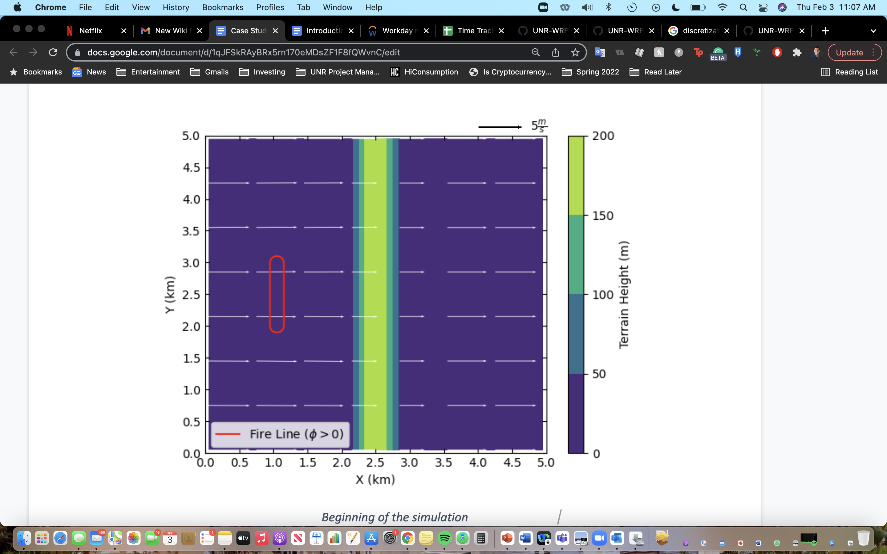
  
10 min after start of the simulation 
^^^^^^^^^^^^^^^^^^^^^^^^^^^^^^^^^^^^
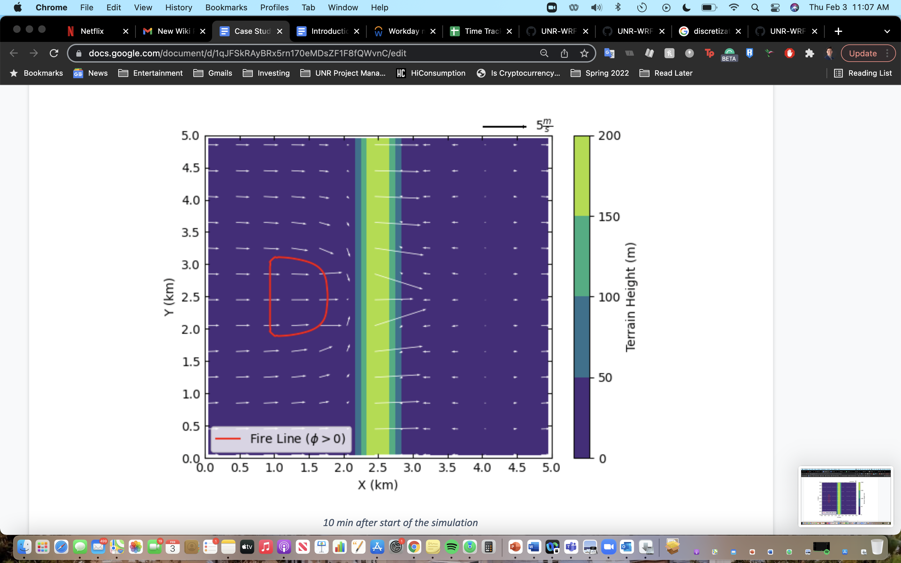
  
20 min after start of the simulation
^^^^^^^^^^^^^^^^^^^^^^^^^^^^^^^^^^^^
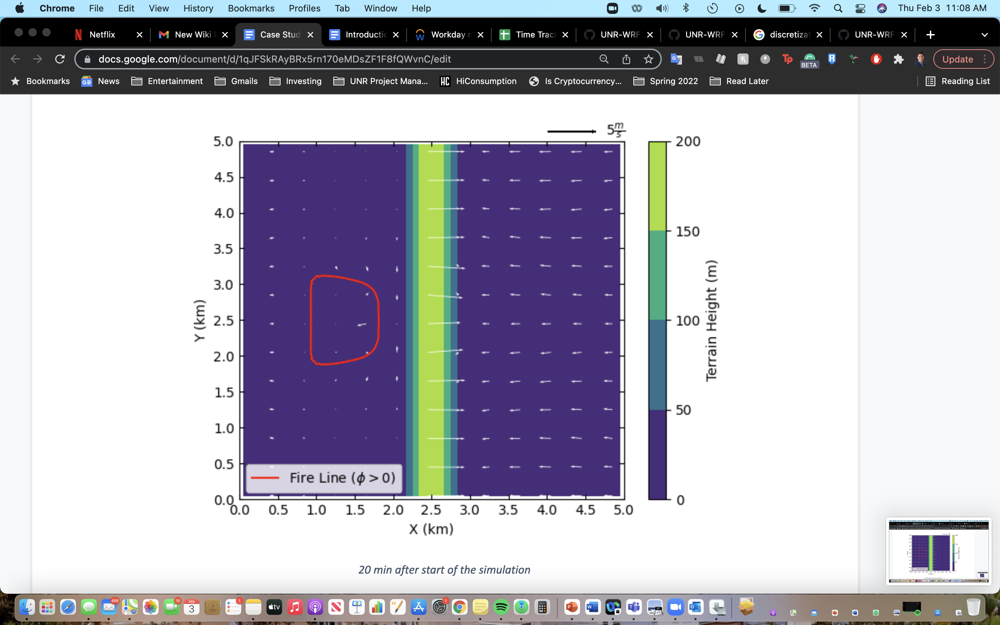
  
40 min after start of the simulation
^^^^^^^^^^^^^^^^^^^^^^^^^^^^^^^^^^^^
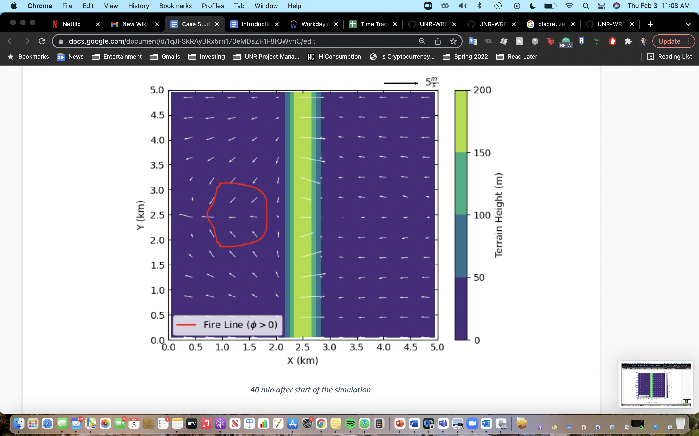
  
60 min after the start of simulation (end of the simulation)
^^^^^^^^^^^^^^^^^^^^^^^^^^^^^^^^^^^^^^^^^^^^^^^^^^^^^^^^^^^^
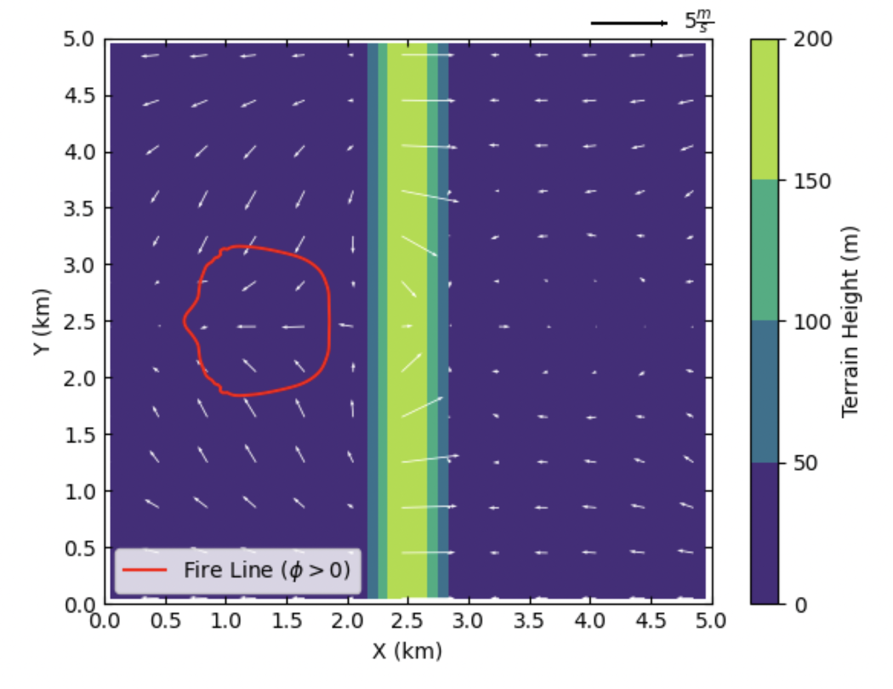
