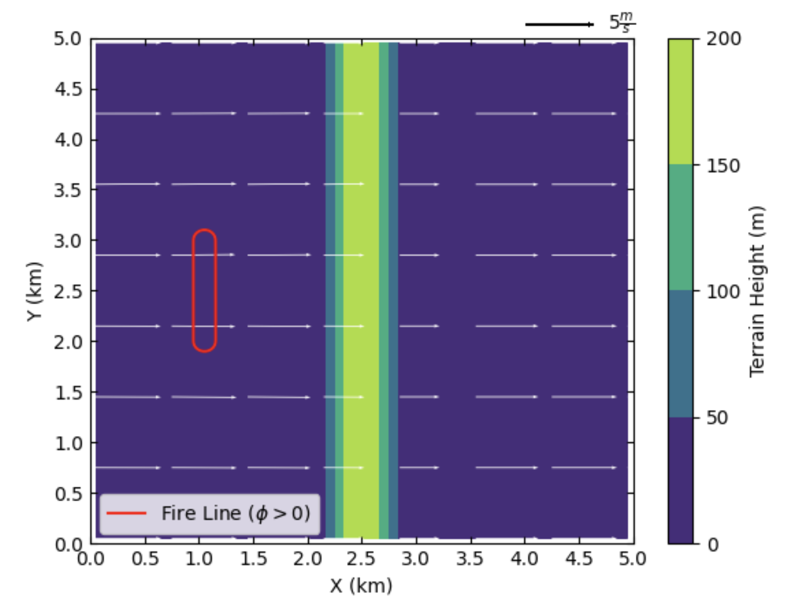
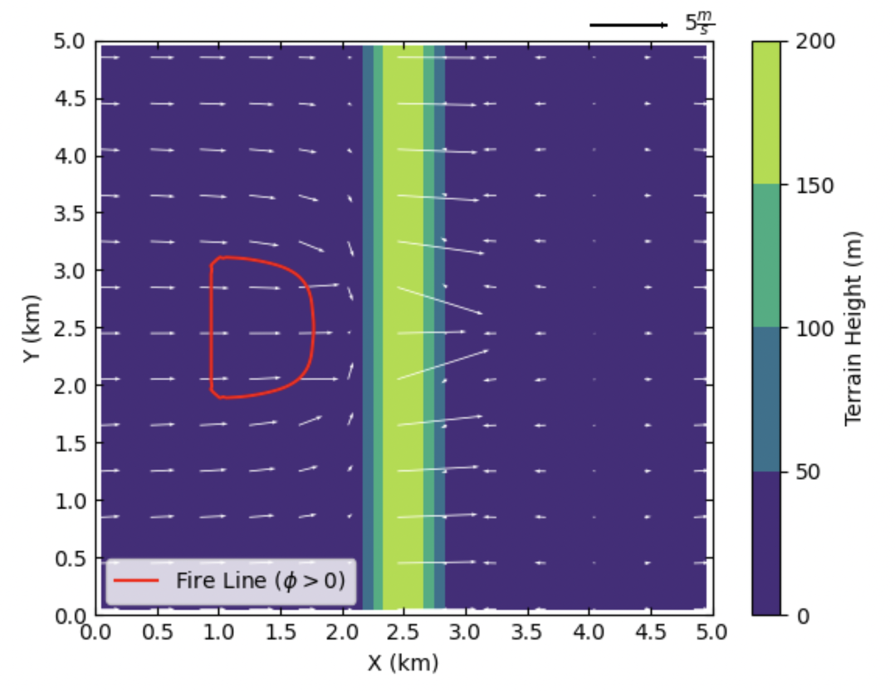
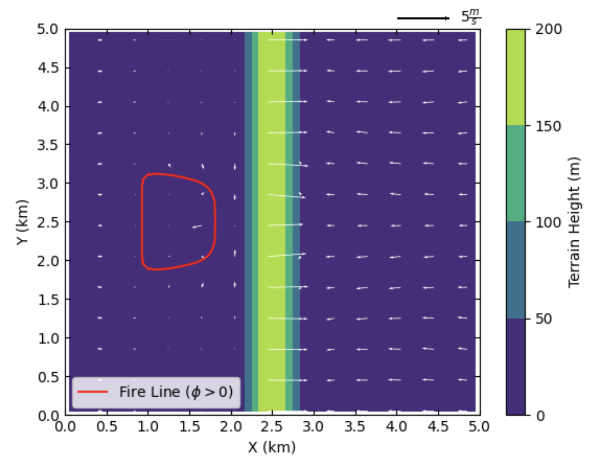
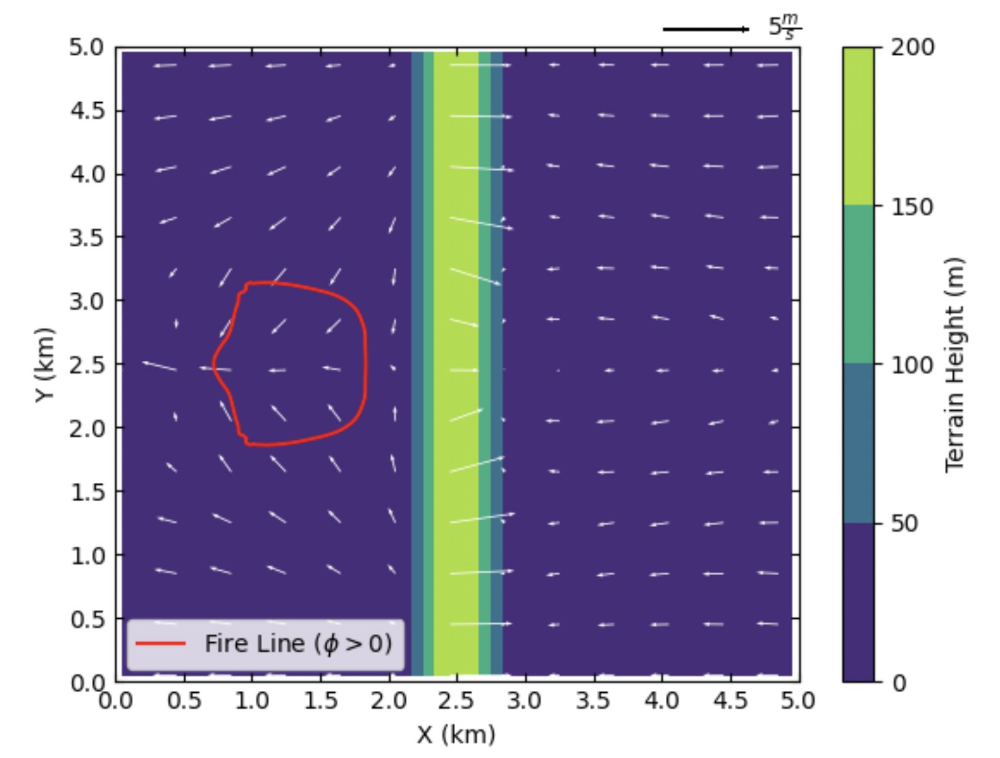
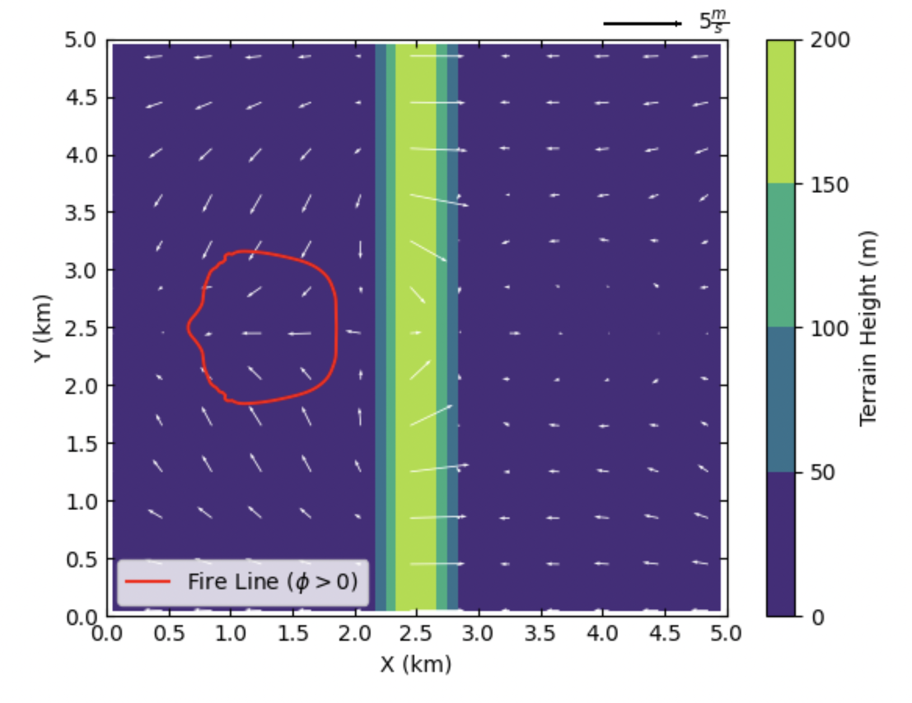

=======================================================================
Case Study 2: Idealized Flat-surface Coupled Model with Idealized Ridge
=======================================================================
The second case study is same as the first case study except the model in now coupled and an idealized ridge is added to the model. The model is initialized with a uniform wind field, and all the atmospheric options are turned off in this case. The surface is assumed to be slip-free with zero heat fluxes, and therefore, the surface will not affect the simulated wind field. The main goal of this case is to introduce the coupling and idealized topography options within WRF-Fire. As a coupled model with a ridge, this case represents the effects of fire on the atmosphere (i.e., the simulated wind field), and the effects of topography on fire propagation process. Since this case is based on the :ref:`first case study<case1>`, it is highly recommended to read the first case study, and the options that are same as the first case will not be explained here. For the description of the required input files, refer to :ref:`Case Study 1-Input Files<c1IF>`.

Input Files
^^^^^^^^^^^

Namelist.input
~~~~~~~~~~~~~~

**&time_control**

The options and values used for this case study are same as the Case Study 1 and shown below.

::
 
   &time_control
   run_days                            = 0,
   run_hours                           = 1,
   run_minutes                         = 0,
   run_seconds                         = 0,
   start_year                          = 0001,
   start_month                         = 01,
   start_day                           = 01,
   start_hour                          = 00,
   start_minute                        = 00,
   start_second                        = 00,
   end_year                            = 0001,
   end_month                           = 01,
   end_day                             = 01,
   end_hour                            = 1,
   end_minute                          = 00,
   end_second                          = 00, 
   history_interval_s                  = 120,
   frames_per_outfile                  = 1,
   restart                             = .false.,
   !restart_interval                    = 30,
   io_form_history                     = 2,
   io_form_restart                     = 2,
   io_form_input                       = 2,
   io_form_boundary                    = 2,
   /
   
Same as the Case Study 1, the simulation duration of this case is one hour, and output files are generated each 2 minutes.

**&domains**

The domains setup of this case including domain size, time step, and fire domain setup is exactly the same as the Case Study 1. 

::

   &domains
   time_step                           = 0,
   time_step_fract_num                 = 1,
   time_step_fract_den                 = 4,
   max_dom                             = 1,
   s_we                                = 1,
   e_we                                = 51,
   s_sn                                = 1,
   e_sn                                = 51,
   s_vert                              = 1,
   e_vert                              = 101,
   dx                                  = 100.00,
   dy                                  = 100.00,
   ztop                                = 2000,
   grid_id                             = 1,
   parent_id                           = 0,
   i_parent_start                      = 0,
   j_parent_start                      = 0,
   parent_grid_ratio                   = 1,
   parent_time_step_ratio              = 1,
   sr_x                                = 4,
   sr_y                                = 4,
   /
   
The model utilizes a 5 by 5 km domain with the atmospheric grid size of 100 m and the model top at 2 km. the time step is set to 0.25 s. The fire grid is 4 times finer than the atmospheric domain.

**&physics**

All the physics options in this case are turned off same as the previous case study.

::

   &physics
   mp_physics                          = 0,
   ra_lw_physics                       = 0,
   ra_sw_physics                       = 0,
   sf_sfclay_physics                   = 0,
   sf_surface_physics                  = 0,
   bl_pbl_physics                      = 0,
   bldt                                = 0,
   cu_physics                          = 0,
   cudt                                = 0,
   isfflx                              = 0,
   ifsnow                              = 0,
   icloud                              = 0,
   mp_zero_out                         = 0,
   /

**&dynamics**

Dynamics options of this model are the same as the Case Study 1.

::

   &dynamics
   hybrid_opt                          = 0,
   rk_ord                              = 3,
   diff_opt                            = 0,
   km_opt                              = 0,
   tke_drag_coefficient                = 0.0,
   tke_heat_flux                       = 0.0,
   non_hydrostatic                     = .true.,
   h_mom_adv_order                     = 5,
   v_mom_adv_order                     = 3,
   h_sca_adv_order                     = 5,
   v_sca_adv_order                     = 3,
   time_step_sound                     = 20,
   moist_adv_opt                       = 1,
   scalar_adv_opt                      = 1,
   tracer_opt                          = 3,
   /

**&bdy_control**

Periodic boundary condition is used in both X and Y directions in this model.

::

   &bdy_control
   periodic_x                          = .true.,
   symmetric_xs                        = .false.,
   symmetric_xe                        = .false.,
   open_xs                             = .false.,
   open_xe                             = .false.,
   periodic_y                          = .true.,
   symmetric_ys                        = .false.,
   symmetric_ye                        = .false.,
   open_ys                             = .false.,
   open_ye                             = .false.,
   /
   
**&namelist_quilt**

Reserved CPU cores (“nio_tasks_per_group”) for managing the outputs is set to zero as this case is a simple small case.

::
 
   &namelist_quilt
   nio_tasks_per_group = 0,
   nio_groups = 1,
   /
   
**&fire**

The atmospheric options of this case study (i.e., WRF model options) were all the same as Case Study 1. WRF-Fire options are also the same as the previous case except with few changes to turn on fire-atmosphere coupling and add an idealized ridge.  For the purpose of the tutorial, the options within “&fire” is divided into multiple sub-sections as follows.

::

   ifire              = 2,
   fire_fuel_read     = 0,
   fire_fuel_cat      = 1, 
   fire_num_ignitions     = 1,
   fire_ignition_start_x1 = 1050., 
   fire_ignition_start_y1 = 2000., 
   fire_ignition_end_x1   = 1050., 
   fire_ignition_end_y1   = 3000.,
   fire_ignition_ros1 =   110,
   fire_ignition_radius1  = 100, 
   fire_ignition_start_time1 = 10, 
   fire_ignition_end_time1  = 11, 
   
The above set of options, which are used to turn on the fire module (i.e., WRF-Fire), define fuel type, define ignition, are same as the Case Study 1. Fuel type is set to fuel category 1, short grass, and a 1 km long 100 m wide ignition line is used to ignite the fire.

:: 

   fire_mountain_type = 3
   fire_mountain_height = 300
   fire_mountain_start_x = 2000
   fire_mountain_start_y = 0
   fire_mountain_end_x = 3000
   fire_mountain_end_y = 5000

The above options define the idealized topography in the domain. “fire_mountain_type” defines the mountain type which can be 0 = none, (2) 1 = hill, (3) 2 = east-west ridge, or (4) 3 = north-south ridge. In this case, we use option 3 which is north-south ridge with a height of 300 m defined by “fire_mountain_height” option. “fire_mountain_start_*” and “fire_mountain_end_*” options define the X and Y coordinates of the ridge start and end locations, respectively, in meters from the lower left corner of the domain. 

::

   fire_print_msg     = 1,
   fire_wind_height = 6.5, 
   fire_topo_from_atm = 1,
   fire_atm_feedback = 1.0,
   fire_viscosity = 0.4, 
   fire_upwinding = 7,
   fire_boundary_guard=-1,
   
These options are same as the Case Study 1 except the “fire_atm_feedback” is changed to 1, meaning the fire-atmosphere coupling is turned on in this case.

The “&fire” section of this case study is as follows.

::

   &fire
   ifire              = 2,
   fire_fuel_read     = 0,
   fire_fuel_cat      = 1, 
   fire_num_ignitions     = 1,
   fire_ignition_start_x1 = 1050., 
   fire_ignition_start_y1 = 2000., 
   fire_ignition_end_x1   = 1050., 
   fire_ignition_end_y1   = 3000.,
   fire_ignition_ros1 =   110,  !set to large value to prevent ignition issue as described in Case Study 1
   fire_ignition_radius1  = 100, 
   fire_ignition_start_time1 = 10, 
   fire_ignition_end_time1  = 11, 
   fire_mountain_type = 3
   fire_mountain_height = 200
   fire_mountain_start_x = 2000
   fire_mountain_start_y = 0
   fire_mountain_end_x = 3000
   fire_mountain_end_y = 5000
   fire_print_msg     = 1,
   fire_wind_height = 6.5, 
   fire_topo_from_atm = 1,
   fire_atm_feedback = 1.0,
   fire_viscosity = 0.4, 
   fire_upwinding = 7,
   fire_boundary_guard=-1,
   /

**Namelist.fire**

For this case, we use the namelist.fire of Case Study 1 which defines the fuel types based on Anderson’s 13 fuel model. The structure of “namelist.fire” fire and the options definition are provided in :ref:`Case Study 1-namelist.fire<c1NF>`. The namelist.fire of this case is as follows.

**&fuel_scalars**

::

   &fuel_scalars                    
   cmbcnst  = 17.433e+06,             
   hfgl     = 17.e4 ,             
   fuelmc_g = 0.08,                  
   fuelmc_c = 1.00,              
   nfuelcats = 13,                    
   no_fuel_cat = 14                 
   /
   
**&fuel_categories**

::

   &fuel_categories                 
   windrf= 0.36, 0.36, 0.44,  0.55,  0.42,  0.44,  0.44,
         0.36, 0.36, 0.36,  0.36,  0.43,  0.46, 1e-7
   fgi =  0.166, 0.897, 0.675, 2.468, 0.785, 1.345, 1.092, 
        1.121, 0.780, 2.694, 2.582, 7.749, 13.024, 1.e-7, 
   fueldepthm=0.305, 0.305, 0.762, 1.829, 0.61,  0.762, 0.762, 
            0.061, 0.061, 0.305, 0.305, 0.701, 0.914, 0.305,
   savr = 3500., 2784., 1500., 1739., 1683., 1564., 1562.,  
        1889., 2484., 1764., 1182., 1145., 1159., 3500.,
   fuelmce = 0.12, 0.15, 0.25, 0.20, 0.20, 0.25, 0.40,  
           0.30, 0.25, 0.25, 0.15, 0.20, 0.25, 0.12,  
   fueldens = 32.,32.,32.,32.,32.,32.,32. ,
            32.,32.,32.,32.,32.,32.,32. ,
   st = 0.0555, 0.0555, 0.0555, 0.0555, 0.0555, 0.0555, 0.0555,
      0.0555, 0.0555, 0.0555, 0.0555, 0.0555, 0.0555, 0.0555,
   se = 0.010, 0.010, 0.010, 0.010, 0.010, 0.010, 0.010,
      0.010, 0.010, 0.010, 0.010, 0.010, 0.010, 0.010, 
   weight = 7.,  7.,  7., 180., 100., 100., 100.,  
         900., 900., 900., 900., 900., 900., 7. ,
   /
   
Input_sounding
~~~~~~~~~~~~~~

The “input_sounding” file of this case is exactly the same as Case Study 1, and it is as follows. Fore information on “input_sounding” file structure and how to create it, refer to :ref:`Case Study 1-input_sounding<c1IS>`.

::

   1000	305	0.0
   1.0	300	0.0	5.0	0
   6.0	300	0.0	5.0	0
   9.1	300	0.0  5.0	0
   18.3	300	0.0  5.0	0
   18.35	300	0.0	5.0	0
   91.2	300	0.0	5.0	0
   100	300	0.0	5.0	0
   200	300	0.0	5.0	0
   300	300	0.0	5.0	0
   400	300	0.0	5.0	0
   500	300	0.0	5.0	0
   600	300	0.0	5.0	0
   700	300	0.0	5.0	0
   800	300	0.0	5.0	0
   900	300	0.0	5.0	0
   1000	300	0.0	5.0	0
   1100	301	0.0	5.0	0
   1200	302	0.0	5.0	0
   1300	303	0.0	5.0	0
   1400	304	0.0	5.0	0
   1500	305	0.0	5.0	0
   1600	306	0.0	5.0	0
   1700	307	0.0	5.0	0
   1800	308	0.0	5.0	0
   1900	309	0.0	5.0	0
   2000	310	0.0	5.0	0
   2100	311	0.0	5.0	0

Sample Output
^^^^^^^^^^^^^
Sample outputs of this case study is shown below are plotted using the Python code presented :ref:`here<python>`. The Python code is the same code used in Case Study 1.

This model represents the effects of topography on the simulated wind field and the effects of fire-atmosphere coupling on the fire propagation process. Although an initial uniform 5 ms-1 wind is imposed to the domain, the tall ridge alters the wind speed and reverses the wind direction toward the negative X direction. This alternation causes the fire to propagate toward the negative X direction which is along the wind direction, and it is in agreement with Rothermel’s ROS theory. Furthermore, the heat flux from the fire creates a vertical updraft at the fire head that sucks air into the fire base. This suction causes the wind field to be redirected toward the fire head 40 min after ignition resulting in a clear fire finger toward the wind direction (i.e., negative X direction). Near the end of the simulation, the suction also causes the wind speed at the front of the fire to reach zero, and prevents the fire to further spread.

.. centered:: Beginning of the simulation
  

.. centered:: 10 min after start of the simulation 
  

.. centered:: 20 min after start of the simulation
  

.. centered:: 40 min after start of the simulation
  

.. centered:: 60 min after the start of simulation (end of the simulation) 
