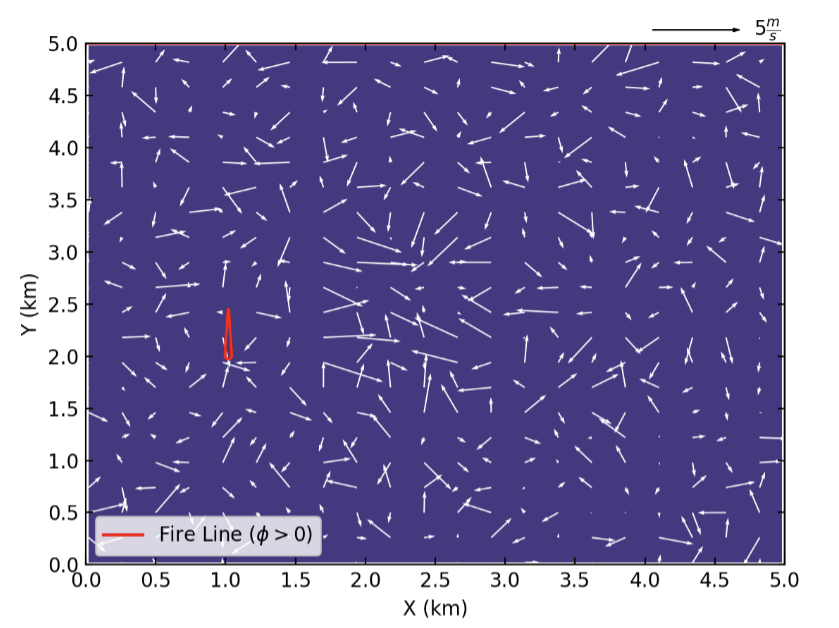
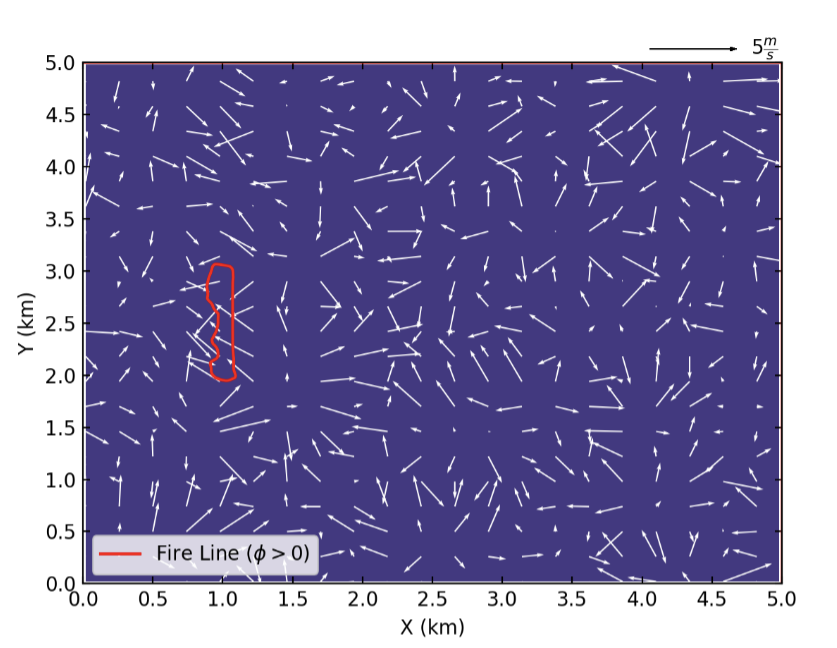
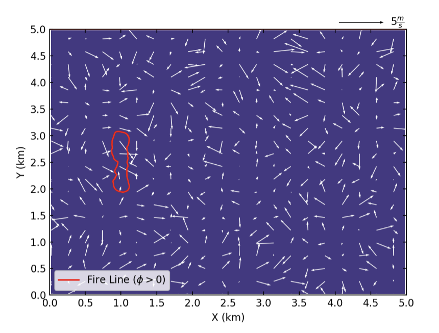
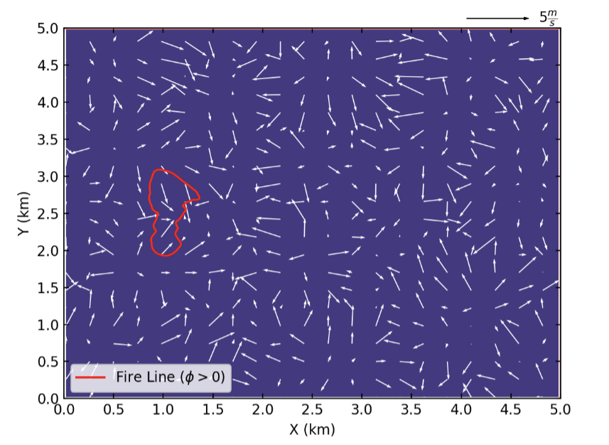
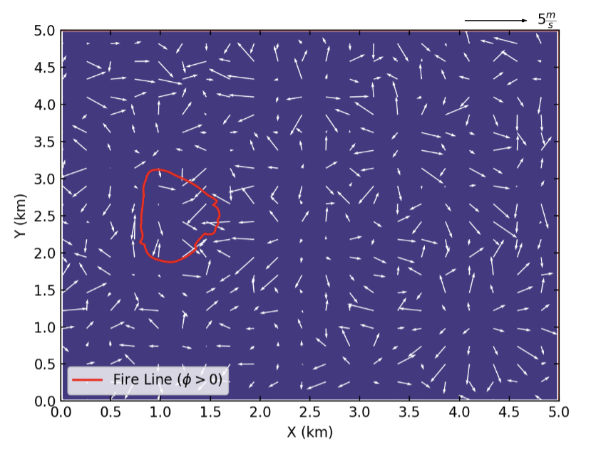
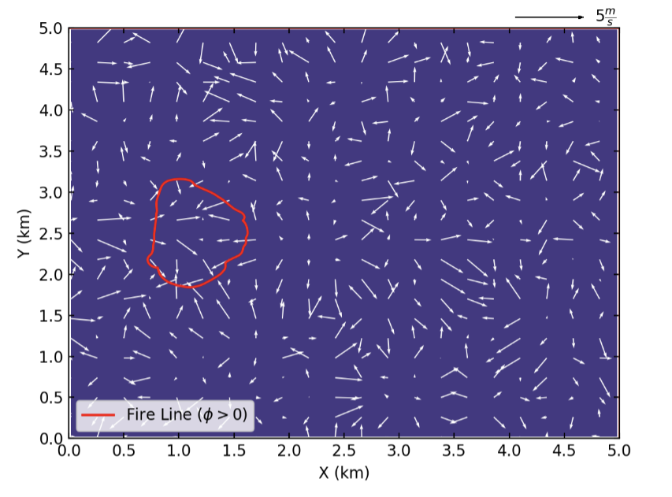
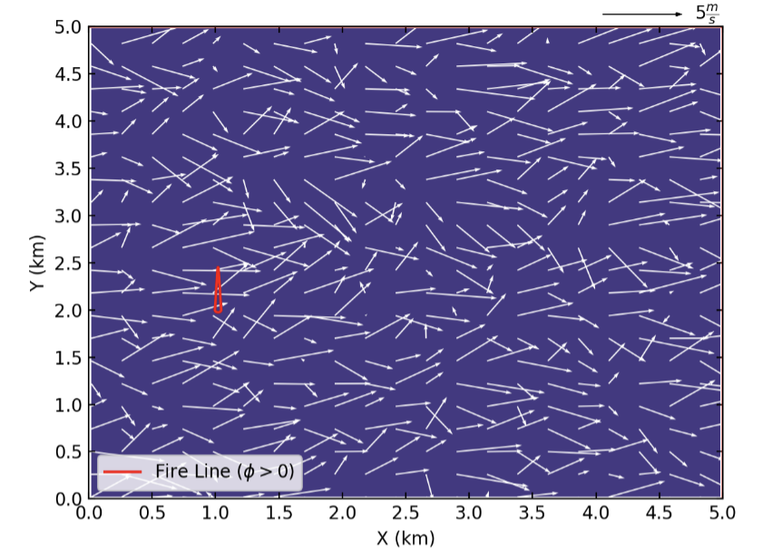
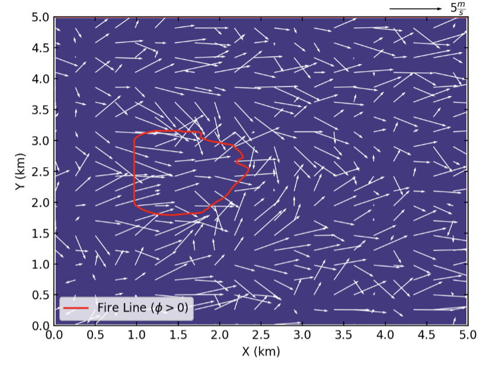
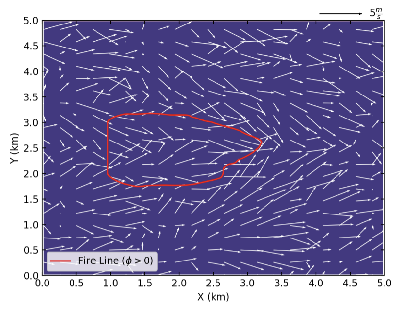
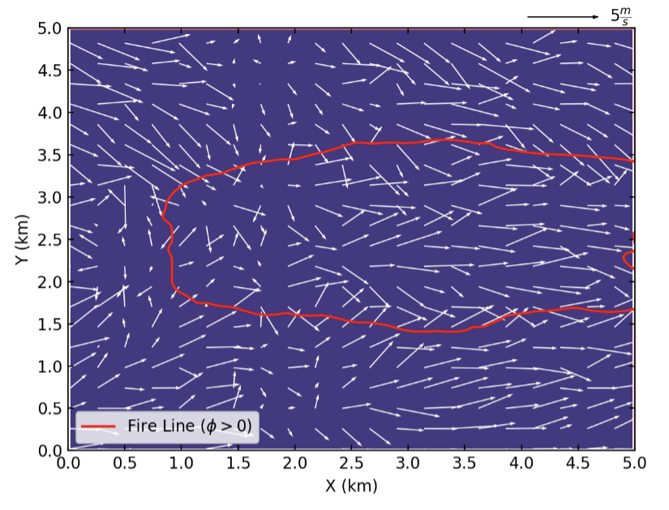

============================================================================================
Case Study 3: Idealized Flat-surface Coupled Model Configured in Large Eddy Simulation (LES)
============================================================================================

The third case study presented in herein dives deeper into the atmospheric options of WRF atmospheric simulation model. The case study presented herein replicates the model used by Coen et al. [1]. By configuring the model in LES mode, the model will resolve turbulent eddies and develop a well-mixed boundary layer. Therefore, the atmospheric domain of the case study will have turbulence in contrast to the previous case studies, which had uniform wind field. The model is initialized with a uniform wind field, and the atmospheric options are configured for LES simulation. The surface is assumed to be an idealized surface with constant heat flux and drag coefficient. More sophisticated representation of the surface will be presented in real data case study. The main goal of this case is to teach how to correctly setup WRF-Fire in LES mode in idealized cases and show the effects of LES in fire spread process. For the description of the required input files, refer to :ref:`Case Study 1-Input Files<c1IF>`. Moreover, studying Case Study 1 before moving to this case is highly recommended as the options described in Case Study 1 are not explained here.

Input Files
^^^^^^^^^^^

Namelist.input
~~~~~~~~~~~~~~

**&time_control**

The options and values used for this case study are same as the Case Study 1 and shown below.

::

   &time_control
   run_days                            = 0,
   run_hours                           = 2,
   run_minutes                         = 0,
   run_seconds                         = 0,
   start_year                          = 0001,
   start_month                         = 01,
   start_day                           = 01,
   start_hour                          = 00,
   start_minute                        = 00,
   start_second                        = 00,
   end_year                            = 0001,
   end_month                           = 01,
   end_day                             = 01,
   end_hour                            = 2,
   end_minute                          = 00,
   end_second                          = 00,
   history_interval_s                  = 600,
   frames_per_outfile                  = 1,
   restart                             = .false.,
   !restart_interval                    = 30,
   io_form_history                     = 2,
   io_form_restart                     = 2,
   io_form_input                       = 2,
   io_form_boundary                    = 2,
   /
   
The simulation in this case study is run for 2 hours (see “start_hour” and “end_hour” options), and the output interval is set to 600 seconds (“history_interval_s), i.e., WRF-Fire will generate an output file each 10 minutes.

**&domains**

The domains setup of this case including domain size, time step, and fire domain setup is exactly the same as the Case Study 1. 

::

   &domains
   time_step                           = 0,
   time_step_fract_num                 = 1,
   time_step_fract_den                 = 2,
   max_dom                             = 1,
   s_we                                = 1,
   e_we                                = 126,
   s_sn                                = 1,
   e_sn                                = 126,
   s_vert                              = 1,
   e_vert                              = 52,
   dx                                  = 40,
   dy                                  = 40,
   ztop                                = 2000,
   grid_id                             = 1,
   parent_id                           = 0,
   i_parent_start                      = 1,
   j_parent_start                      = 1,
   parent_grid_ratio                   = 1,
   parent_time_step_ratio              = 1,
   feedback                            = 1,
   smooth_option                       = 0,
   sr_x                                = 8,
   sr_y                                = 8,
   /
   
The time step of this case study is set to 0.5 second (“time_step_fract_num” determines the time step nominator and “time_step_fract_den” determines the time step denominator). The model utilizes a single domain (“max_dom”) with grid size 40 m in both X and Y direction (“dx” and “dy”). The number of grid points in both X and Y direction is equal to 126 grid points (see “s_we” and “e_we” for X direction, and “s_sn” and “e_sn” for Y direction), which results in a 5 by 5 km domain. The fire grid is eight times finer than the atmospheric domain on both X and Y directions (“sr_x” and “sr_y”). Other domain setup options are the same as Case Study 1.

**&physics**

The physics options of this case study are as follows.

::

  &physics
  mp_physics                          = 0,
  ra_lw_physics                       = 0,
  ra_sw_physics                       = 0,
  sf_sfclay_physics                   = 0,
  sf_surface_physics                  = 0,
  bl_pbl_physics                      = 0,
  bldt                                = 0,
  cu_physics                          = 0,
  cudt                                = 0,
  isfflx                              = 0,
  ifsnow                              = 0,
  icloud                              = 0,
  mp_zero_out                         = 0,
  /
  
Since the goal is to simulate an idealized surface in LES mode with constant defined surface heat flux and drag, the surface model (sf_sfclay_physics”) is turned off in this case. Other options for surface parametrization scheme are available at WRF’s User’s Guide Chapter 5. “sf_surface_physics” indicates the land-surface parametrization scheme which is used to parametrize the land features such as land cover (i.e., vegetation) In this case, however, we are not using this option, and we will define an idealized surface in the “&dynamics” section. “bl_pbl_physics” controls the Planetary Boundary Layer (PBL) parametrization which in this case is set to 0 indicating that no PBL scheme is used. This option must be set to 0 to configure the domain in LES mode. Moreover, the "isfflx" option is set to zero to make the model use the defined surface heat flux and drag as indicated in "&dynamics" section.

**&dynamics**

Dynamics options is one of the key sections in configuring an idealized case in LES mode. The dynamics options of this case study are as follows.

::

   &dynamics
   hybrid_opt                          = 0,
   rk_ord                              = 3,
   diff_opt                            = 2,
   km_opt                              = 2,
   damp_opt                            = 0,
   c_s                                 = 0.18,
   c_k                                 = 0.10,
   tke_drag_coefficient                = 0.005,
   tke_heat_flux                       = 0.10,
   mix_isotropic                       = 1,
   mix_full_fields                     = .true.,
   non_hydrostatic                     = .true.,
   h_mom_adv_order                     = 5,
   v_mom_adv_order                     = 3,
   h_sca_adv_order                     = 5,
   v_sca_adv_order                     = 3,
   time_step_sound                     = 10,
   moist_adv_opt                       = 1,
   scalar_adv_opt                      = 1,
   tracer_opt                          = 3,
   pert_coriolis                       = .true.,
   /
   
Most of the dynamics options are the same as the previous two case studies, and the user is referred to Case Study 1 for options that are not explained in this section. In this case, “diff_opt” is set to 2 which indicates full diffusion scheme in all the X, Y, and Z dimension. This options, in general, controls the turbulence and mixing (i.e., diffusion) scheme of WRF atmospheric model. “km_opt” is set to 3 in this case study which means that the model will use 3D Turbulent Kinetic Energy (TKE) scheme to determine eddy coefficients for the diffusion scheme used (“diff_opt”). Uper-level damping is turned off in the simulation by setting “damp_opt” to zero. Smagorinsky (“c_s”) and TKE (“c_k”) coefficients are set to 0.18 and 0.1, respectively. The options that are added and/or modified to this point of dynamics section in comparison to the previous case studies are to setup the atmospheric model in LES mode. To create the desired idealized surface in this case study, the drag coefficient (” tke_drag_coefficient”) and the heat flux (“tke_heat_flux”) of the surface is set to constant 0.005 and 0.1 (in K ms-1), respectively. Another option turned on for this model is “pert_coriolis” which applies the Coriolis term to the wind. This option must be enabled when simulating in an idealized case in LES mode. Other dynamics options of this case study are same as Case Study 1, and they are explained in that case study.

**&bdy_control**

Periodic boundary condition is used in both X and Y directions in this model.

::

   &bdy_control
   periodic_x                          = .true.,
   symmetric_xs                        = .false.,
   symmetric_xe                        = .false.,
   open_xs                             = .false.,
   open_xe                             = .false.,
   periodic_y                          = .true.,
   symmetric_ys                        = .false.,
   symmetric_ye                        = .false.,
   open_ys                             = .false.,
   open_ye                             = .false.,
   /
   
**&namelist_quilt**

Reserved CPU cores (“nio_tasks_per_group”) for managing the outputs is set to zero as this case is a simple small case.

::

   &namelist_quilt
   nio_tasks_per_group = 0,
   nio_groups = 1,
   /
   
**&fire**

The fire section options (i.e., WRF-Fire options) of this case study are the same as Case Study 1 except a temparture perturbation bubble is added to kick-off the turbulence for LES.  For the purpose of the tutorial, the options within “&fire” is divided into multiple sub-sections as follows.
 
::

   ifire              = 2,
   fire_fuel_read     = 0,
   fire_fuel_cat      = 1, 
   fire_num_ignitions     = 1,
   fire_ignition_start_x1 = 1020., 
   fire_ignition_start_y1 = 2000., 
   fire_ignition_end_x1   = 1020., 
   fire_ignition_end_y1   = 3000.,
   fire_ignition_ros1 =    50,
   fire_ignition_radius1  = 40, 
   fire_ignition_start_time1 = 1800, 
   fire_ignition_end_time1  = 1801, 
  
The above set of options, which are used to turn on the fire module (i.e., WRF-Fire), define fuel type, define ignition, are same as the Case Study 1 with some differences in the ignition characteristics. The ignition in this case is a 1 km long 40 m wide ignition line, and the ignition ROS is set to 50 ms-1 to avoid the ignition issue explained in Case Study 1. The fire is ignited 30 min after the simulation start time (“fire_ignition_start_time1” and “fire_ignition_end_time1”), hence allowing the atmospheric model to run 30 min prior to ignition. This 30 min period is called “spin-up” time, and it is required in LES models to allow the atmospheric model to develop turbulence and resolve turbulent eddies [2], [3]. Furthermore, fuel type is set to fuel category 1, short grass, using “fire_fuel_cat” option.

::

   delt_perturbation = 0.5
   xrad_perturbation = 2500.0
   yrad_perturbation = 2500.0
   zrad_perturbation = 40.0
   hght_perturbation = 40.0

The above options define a temperature perturbation bubble required to kick-off the turbulence for idealized LES simulations [2], [3]. Without this bubble, the model needs a significant amount of time to produce turbulence and achieve an equilibrium state. The magnitude of temperature perturbation is set to 0.5 K (“delt_perturbation”). The radius of the bubble in both X (“xrad_perturbation”) and Y (“yrad_perturbation”) directions is set to 2500 m covering the entire domain. The vertical radius of the bubble (“zrad_perturbation”) is set to 40 m, and the location of the center of the bubble (“hght_perturbation”) is at 40 m. Therefore, the bubble covers the surface to 80 m above ground level. The 80 m vertical coverage of the perturbation bubble is required to ensure that the turbulence will be generated in the model.

::

   stretch_hyp = .true.,
   z_grd_scale = 1.09,
   
The above two options are used to make the vertical levels distribution hyperbolic. The hyperbolic distribution results in high resolution vertical levels near the surface, and coarser vertical levels near the model top. The hyperbolic vertical distribution is required to avoid violating CFL stability condition due to large fire-induced strong updrafts [4]. The hyperbolic distribution is turned on using “stretch_hyp” option, and the scaling (“z_grd_scale”) is set to 1.09 to ensure high resolution vertical levels near the surface.

::

   fire_print_msg     = 1,
   fire_wind_height = 6.5, 
   fire_topo_from_atm = 1,
   fire_atm_feedback = 1.0,
   fire_viscosity = 0.4, 
   fire_upwinding = 9,
   fire_boundary_guard=-1,
   
These options are same as Case Study 2 except hybrid WENO5/ENO spatial discretization is used to solve the level set equation [5]. This discretization is activated by setting “fire_upwinding” to 9.
The “&fire” section of this case study is as follows.

::

   &fire
   ifire              = 2,
   fire_fuel_read     = 0,
   fire_fuel_cat      = 1, 
   fire_num_ignitions     = 1,
   fire_ignition_start_x1 = 1020., 
   fire_ignition_start_y1 = 2000., 
   fire_ignition_end_x1   = 1020., 
   fire_ignition_end_y1   = 3000.,
   fire_ignition_ros1 =   50,  !set to large value to prevent ignition issue as described in Case Study 1
   fire_ignition_radius1  = 40, 
   fire_ignition_start_time1 = 1800, 
   fire_ignition_end_time1  = 1801, 
   delt_perturbation = 0.5
   xrad_perturbation = 2500.0
   yrad_perturbation = 2500.0
   zrad_perturbation = 40.0
   hght_perturbation = 40.0
   stretch_hyp = .true.,
   z_grd_scale = 1.09,
   fire_print_msg     = 1,
   fire_wind_height = 6.5, 
   fire_topo_from_atm = 1,
   fire_atm_feedback = 1.0,
   fire_viscosity = 0.4, 
   fire_upwinding = 9,
   fire_boundary_guard=-1,
   /

Namelist.fire
~~~~~~~~~~~~~

For this case, we use the namelist.fire of Case Study 1 which defines the fuel types based on Anderson’s 13 fuel model [6]. The structure of “namelist.fire” fire and the options definition are provided in :ref:`Case Study 1-namelist.fire<c1NF>`. The namelist.fire of this case is as follows.

**&fuel_scalars**

::

   &fuel_scalars                    
   cmbcnst  = 17.433e+06,             
   hfgl     = 17.e4 ,             
   fuelmc_g = 0.08,                  
   fuelmc_c = 1.00,              
   nfuelcats = 13,                    
   no_fuel_cat = 14                 
   /

**&fuel_categories**

::

   &fuel_categories                 
   windrf= 0.36, 0.36, 0.44,  0.55,  0.42,  0.44,  0.44,
         0.36, 0.36, 0.36,  0.36,  0.43,  0.46, 1e-7
   fgi =  0.166, 0.897, 0.675, 2.468, 0.785, 1.345, 1.092, 
        1.121, 0.780, 2.694, 2.582, 7.749, 13.024, 1.e-7, 
   fueldepthm=0.305, 0.305, 0.762, 1.829, 0.61,  0.762, 0.762, 
            0.061, 0.061, 0.305, 0.305, 0.701, 0.914, 0.305,
   savr = 3500., 2784., 1500., 1739., 1683., 1564., 1562.,  
        1889., 2484., 1764., 1182., 1145., 1159., 3500.,
   fuelmce = 0.12, 0.15, 0.25, 0.20, 0.20, 0.25, 0.40,  
           0.30, 0.25, 0.25, 0.15, 0.20, 0.25, 0.12,  
   fueldens = 32.,32.,32.,32.,32.,32.,32. ,
            32.,32.,32.,32.,32.,32.,32. ,
   st = 0.0555, 0.0555, 0.0555, 0.0555, 0.0555, 0.0555, 0.0555,
      0.0555, 0.0555, 0.0555, 0.0555, 0.0555, 0.0555, 0.0555,
   se = 0.010, 0.010, 0.010, 0.010, 0.010, 0.010, 0.010,
      0.010, 0.010, 0.010, 0.010, 0.010, 0.010, 0.010, 
   weight = 7.,  7.,  7., 180., 100., 100., 100.,  
         900., 900., 900., 900., 900., 900., 7. ,
   /
   
Input_sounding
~~~~~~~~~~~~~~

The “input_sounding” file of this case is exactly the same as Case Study 1 except the wind speed is set to zero, and it is as follows. Fore information on “input_sounding” file structure and how to create it, refer to :ref:`Case Study 1-input_sounding<c1IS>`. Note that the initial temperature of the model is linearly increasing from 300 K at 1000 m to 310 K at 2000 m to prevent the turbulence from reaching the model top which is required to properly simulate LES in idealized case.

::

   1000	305	0.0
   1.0	300	0.0	0.0	0
   6.0	300	0.0	0.0	0
   9.1	300	0.0  0.0	0
   18.3	300	0.0  0.0	0
   18.35	300	0.0	0.0	0
   91.2	300	0.0	0.0	0
   100	300	0.0	0.0	0
   200	300	0.0	0.0	0
   300	300	0.0	0.0	0
   400	300	0.0	0.0	0
   500	300	0.0	0.0	0
   600	300	0.0	0.0	0
   700	300	0.0	0.0	0
   800	300	0.0	0.0	0
   900	300	0.0	0.0	0
   1000	300	0.0	0.0	0
   1100	301	0.0	0.0	0
   1200	302	0.0	0.0	0
   1300	303	0.0	0.0	0
   1400	304	0.0	0.0	0
   1500	305	0.0	0.0	0
   1600	306	0.0	0.0	0
   1700	307	0.0	0.0	0
   1800	308	0.0	0.0	0
   1900	309	0.0	0.0	0
   2000	310	0.0	0.0	0
   2100	311	0.0	0.0	0
   
Sample Output
^^^^^^^^^^^^^

The sample outputs for this case study are provided for two scenarios: (1) no initial wind and (2) uniform 2.5 ms-1 wind in the X direction. To simulate the second scenario, the input_sounding must be modified to include the wind speed. The modification can be done using the “input_sounding” description provided in :ref:`Case Study 1<case1>`. Same as the previous case studies, the sample outputs provided below are plotted using the provided Python codes :ref:`here<python>`.

**No Initial Wind Scenario**

Although the initial wind speed of the first scenario is zero, the figure for 30 min after the start of simulation shows non-zero wind as well as not consistent wind speed and direction. This is due to the fact that the model is configured in LES mode, and the heat flux and drag from the surface causes alternations in the atmosphere resulting in the generation of turbulent eddies in the domain 30 min after the start of simulation. After the ignition, the resolved turbulent eddies causes the fire to propagate in all direction at the beginning of the ignition (i.e., 20 min after the ignition). Around 30 min after the ignition, the vertical updraft and downdraft caused by the fire heat flux increases the wind behind the fire head resulting in the fire head to propagate along the X direction. However, the fire almost stops propagating 60 min after the ignition as the wind direction at the front of the fire head is against the fire spread direction. This phenomenon is due to the increased heat flux from the fire that makes the vertical updraft stronger; hence, sucking more air into the base of the fire head and reversing the wind direction at the front of the fire head toward the head. 

.. centered:: Beginning of the ignition (30 min after the start of simulation)
    

.. centered:: 10 min after the ignition
    

.. centered:: 20 min after the ignition
  

.. centered:: 30 min after the ignition
  

.. centered:: 60 min after the ignition
  

.. centered:: 90 min after the ignition (end of the simulation)
  
**Uniform 2.5 ms\ :sup:`-1`\  Initial Wind Scenario**

In this scenario the wind speed is set to 2.5 ms\ :sup:`-1`\  to demonstrate the effects of LES on non-zero wind field. Although the applied initial wind field is uniform 2.5 ms\ :sup:`-1`\,  the wind field is not uniform 30 min after the start of simulation due to the LES. The non-uniform simulated wind field also affects the fire propagation process as seen in the below figures. While the fire maintains the “U” shaped perimeter, which is a characteristic of wind-driven fires, the resolved turbulent eddies due to LES make the fire to propagate with a non-uniform perimeter. Furthermore, the fire perimeter in this case is not symmetric in contrast to the previous case studies, which is also caused by LES configuration of the model. The effects of fire-atmosphere coupling are also evident in this case. The below figure shows that the wind behind the fire head is along the fire spread direction which is as a result of the vertical downdraft generated by the fire heat flux. Moreover, the wind at the front of the fire head is toward the fire head which is due to the air suction to the base of the fire caused by the fire’s vertical plume. This toward wind causes the fire to propagate with a “U” shaped head which, in contrast to Case Study 1 (i.e., uncoupled simulation), has a sharper angle and is more similar to a “V” shape.

  

.. centered:: Beginning of the ignition (30 min after the start of simulation)

.. centered:: 10 min after the ignition
  

.. centered:: 20 min after the ignition
  
.. image:: images/C340.png
  :align: center
  :width: 700
  :height: 400
  :alt: Alternative text
.. centered:: 30 min after the ignition
  

.. centered:: 60 min after the ignition
  
References
^^^^^^^^^^

[1]	J. L. Coen, M. Cameron, J. Michalakes, E. G. Patton, P. J. Riggan, and K. M. Yedinak, “WRF-Fire: Coupled Weather–Wildland Fire Modeling with the Weather Research and Forecasting Model,” J. Appl. Meteorol. Climatol., vol. 52, no. 1, pp. 16–38, Jan. 2013, doi: 10.1175/JAMC-D-12-023.1.

[2]	C.-H. Moeng, J. Dudhia, J. Klemp, and P. Sullivan, “Examining Two-Way Grid Nesting for Large Eddy Simulation of the PBL Using the WRF Model,” Mon. Weather Rev., vol. 135, no. 6, pp. 2295–2311, Jun. 2007, doi: 10.1175/MWR3406.1.

[3]	D. Muñoz-Esparza, B. Kosović, C. García-Sánchez, and J. van Beeck, “Nesting Turbulence in an Offshore Convective Boundary Layer Using Large-Eddy Simulations,” Boundary-Layer Meteorol. 2014 1513, vol. 151, no. 3, pp. 453–478, Feb. 2014, doi: 10.1007/S10546-014-9911-9.

[4]	J. Mandel, J. D. Beezley, and A. K. Kochanski, “Coupled atmosphere-wildland fire modeling with WRF 3.3 and SFIRE 2011,” Geosci. Model Dev., vol. 4, no. 3, pp. 591–610, Jul. 2011, doi: 10.5194/GMD-4-591-2011.

[5]	D. Muñoz-Esparza, B. Kosović, P. A. Jiménez, and J. L. Coen, “An Accurate Fire-Spread Algorithm in the Weather Research and Forecasting Model Using the Level-Set Method,” J. Adv. Model. Earth Syst., vol. 10, no. 4, pp. 908–926, Apr. 2018, doi: 10.1002/2017MS001108.

[6]	H. E. Anderson, Aids to determining fuel models for estimating fire behavior, vol. 122. US Department of Agriculture, Forest Service, Intermountain Forest and Range …, 1981.
