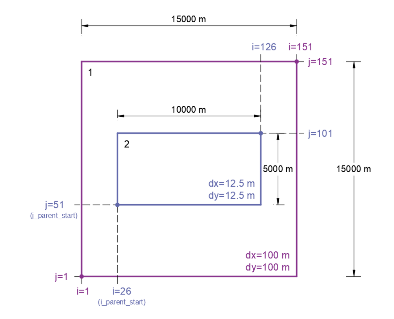
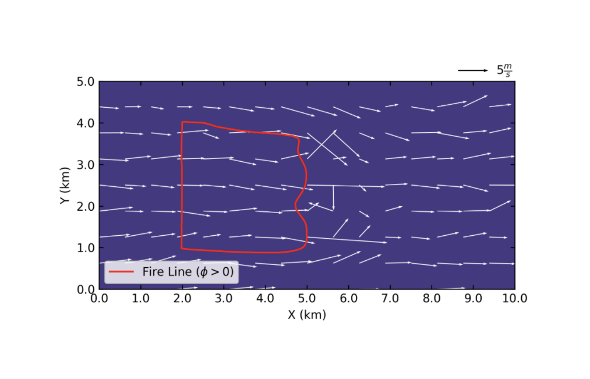
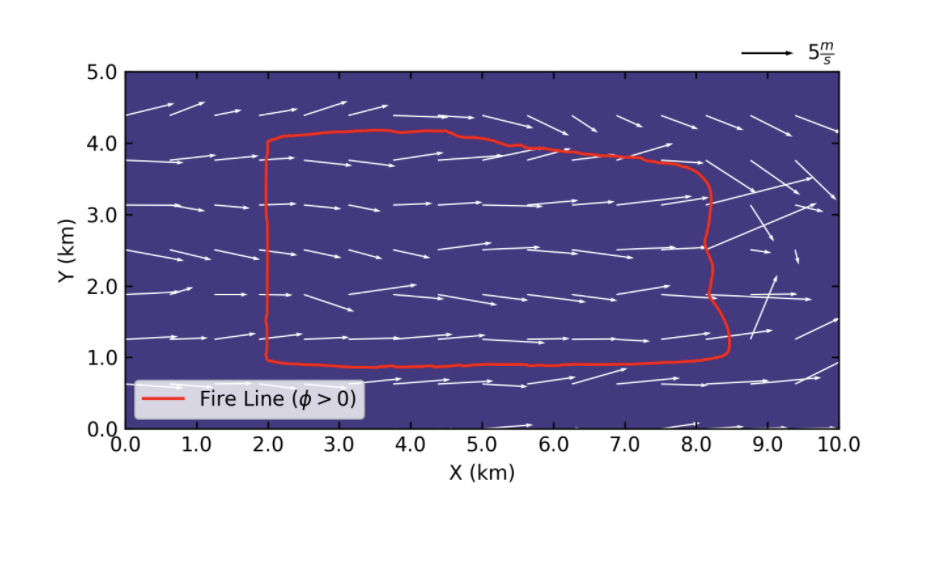
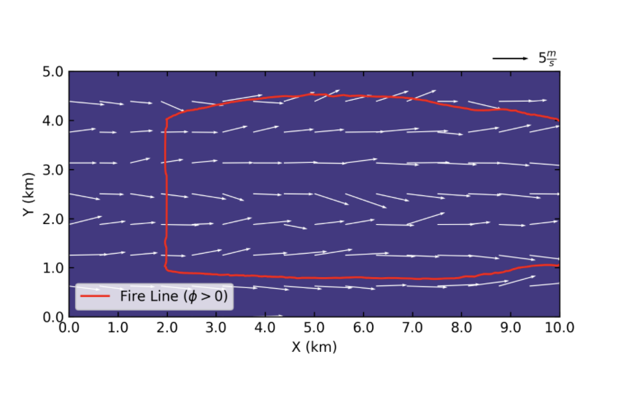

===========================================================================================================
Case Study 4: Idealized Flat-Surface One-way Nested Coupled Model Configured in Large Eddy Simulation (LES)
===========================================================================================================

The fourth case study replicates the second model used by Muñoz-Esparza et al. [1]. The main purpose of this idealized case is to present how to create nested domains utilizing one-way nesting capability of WRF. 
The model is initialized with a uniform wind field, and the atmospheric options are configured for LES simulation following the approach of Case Study 3 with the difference that a surface model is used herein to calculate the surface drag in contrast to the previous case study where a constant drag coefficient was used.

Namelist.input
^^^^^^^^^^^^^^
General structure of the “namelist.input” file is presented in the :ref:`Case Study 1<case1>`. In general, each column in the “namelist.input” file presents information for the corresponding domain number. In other words, options in the “namelist.input” file are a function of nests meaning that specific values should be specified for each of the used domains. This is indicated by (max_dom) following the variable in the Chapter 5 of WRF-ARW’s User’s Guide [2]. The user must always check if an option has this indication to correctly set up the nested domains. In this case, since two nested domains are used, inputs in the first column correspond to the parent domain and inputs in the second column correspond to the nested domain. 

**&time_control**

The temporal setup of the model used for this case study is shown below.

::

   &time_control
   run_days			         = 0,
   run_hours			      = 4, 			
   run_minutes			      = 1,
   run_seconds			      = 0,
   start_year			      = 0001, 	0001,
   start_month			      = 01,		01,
   start_day			      = 01,		01,
   start_hour			      = 00,		03,
   start_minute		      = 00,		00,
   start_second		      = 00,		00,
   end_year			         = 0001,	0001,
   end_month			      = 01,		01,
   end_day			         = 01,		01,
   end_hour			         = 04,		04,
   end_minute			      = 01,		01,
   end_second			      = 00,		00,
   history_interval_s      = 00,		00,
   history_interval_m		= 30,		10,
   frames_per_outfile		= 1,		1,
   restart				      = .false.,
   io_form_history		   = 2,
   io_form_restart		   = 2,
   io_form_input			   = 2, 
   io_form_boundary		   = 2,
   /
   
The simulation duration of this case is four hours and one minute. The parent domain is set to run for a 3 h period prior to initializing the nested domain (see both columns of option “start_hour”). The output files are generated each 30 minutes for the parent domain and each 10 minutes for the child domain (see both columns of option “history_interval_m”). More detailed descriptions of the options used within this section can be found in :ref:`Case Study 1<case1>`.

**&domains**

The domains setup of this case is as follows.

::

   &domains
   time_step			      = 0,
   time_step_fract_num		= 1,
   time_step_fract_den		= 2, 			
   max_dom			         = 2,			
   s_we				         = 1,		1, 	
   e_we				         = 151,		801, 	
   s_sn				         = 1,		1, 	
   e_sn				         = 151,		401, 	
   s_vert				      = 1,		1,
   e_vert				      = 101,		101,
   dx				            = 100,		12.5,
   dy				            = 100,		12.5,
   ztop				         = 2000,	2000,
   grid_id				      = 1,		2,
   parent_id			      = 0,		1,
   i_parent_start			   = 1,		26,	
   j_parent_start			   = 1,		51, 	
   parent_grid_ratio		   = 1,		8,
   parent_time_step_ratio	= 1,		6, 	
   feedback			         = 0,
   smooth_option		      = 0,
   sr_x				         = 1,		1,
   sr_y				         = 1,		1,
   /
   
Option “max_dom” is set to 2, which is the number of domains in this case. The parent domain (“parent_id” = 0 – meaning the outermost domain) of the model has dimensions of 15 by 15 km (see options “s_we”, “e_we”, “s_sn”, “e_sn”) in X and Y directions with grid size of 100 m (see options “dx” and “dy”). A child domain (“parent_id” = 1, indicating that its parent domain is domain 1) with increased horizontal resolution (12.5 m in both X and Y directions) is nested inside the parent domain (see the figure below for details). The model top is located at 2 km for both the domains (“ztop” option). Options “i_parent_start” and “j_parent_start” specify the starting grid point of the domain within its parent domain. For the child domain these options are set to 26 and 51, respectively. “parent_grid_ratio” is set to 1 for the parent domain and 8 for the child domain, reflecting the specified grid resolutions. The time step of the parent domain is set to 0.5 s (“time_step_fract_num” determines the time step nominator and “time_step_fract_den” determines the time step denominator). “parent_time_step_ratio” controls the time step for the child domain, which is 6 in this case study meaning the ratio of parent to child domains time step is 6. “feedback” option is set to 0, not allowing feedback from nest to its parent domain. “smooth_option” is set to 0 (no smoothing of the data for the parent domain in the area of the nest). The fire grid has the same resolution as the atmospheric grid (see options “sr_x” and “sr_y”).

.. centered:: Domains’ setup

**&physics**

For this case study, the physics options are presented below.  

::

   &physics
   mp_physics			      = 0,		0,
   ra_lw_physics			   = 0,		0,
   ra_sw_physics			   = 0,		0,
   sf_sfclay_physics       = 1,		1,
   sf_surface_physics		= 0,		0,
   bl_pbl_physics		      = 0,		0,
   bldt				         = 0,		0,
   cu_physics			      = 0,		0,
   cudt				         = 0,		0,
   isfflx				      = 2,
   ifsnow				      = 0,
   icloud				      = 0,
   mp_zero_out			      = 0,
   /
   
“sf_sfclay_physics” option controls the choice of surface layer scheme that calculate friction velocities and exchange coefficients which in turn enable calculation of surface heat and moisture fluxes. “sf_sfclay_physics” is set to 1 representing Revised MM5 Monin-Obukhov surface layer scheme (surface layer scheme based on the fifth-generation Pennsylvania State University–National Center for Atmospheric Research Mesoscale Model (MM5) parameterization).“bl_pbl_physic s” is set to 0 indicating that no PBL scheme is used. This option must be set to 0 to configure the domain in LES mode as explained in Case Study 3. Moreover, the “isfflx” option is set to 2 to make the model use the defined surface heat flux and model-computed friction velocities. This options is an idealized LES scheme which is outlined in Chapter 5 of WRF-ARW’s User’s Guide.

**&dynamics**

The dynamics options for this case study can be found below.  

::

   &dynamics
   hybrid_opt			= 0,
   rk_ord				= 3,
   diff_opt			= 2,		2,
   km_opt			= 2,		2,
   damp_opt			= 0,
   c_s				= 0.18,		0.18,
   c_k				= 0.1,		0.15,
   tke_heat_flux			= 0.015,	0.015,
   mix_isotropic			= 1,		1,
   mix_full_fields		= .true.,
   non_hydrostatic		= .true.,	.true.,
   h_mom_adv_order		= 5,		5,
   v_mom_adv_order		= 3,		3,
   h_sca_adv_order		= 5,		5,
   v_sca_adv_order		= 3,		3,
   time_step_sound		= 10,		10,
   moist_adv_opt			= 1,		1, 
   scalar_adv_opt		= 1,		1,
   tracer_opt			= 3,		3,
   pert_coriolis			= .true.,	.true.,
   /
   
In this case, “diff_opt” is set to 2 which indicates full diffusion scheme in all directions of WRF atmospheric model. “km_opt” is set to 2 in this case study which means that the model will use 3D Turbulent Kinetic Energy (TKE) scheme to determine eddy coefficients for the diffusion scheme used (“diff_opt”). Upper-level damping is turned off in the simulation by setting (“damp_opt” = 0). Smagorinsky (“c_s”) and TKE (“c_k”) coefficients are set to 0.18 and 0.1 for the parent domain and 0.1 and 0.15 for the child domain, respectively [3]. The heat flux (“tke_heat_flux”) is set to 0.015 K m s-1. “pert_coriolis” option is turned on to apply the Coriolis term to the wind, which is required for idealized LES simulations. The description of other options used within this section and not explained here can be found in :ref:`Case Study 1<case1>`.

**&bdy_control**

Selection of the boundary conditions options for this case study are as follows.  

::

   &bdy_control
   periodic_x			= .true.,	.false.,
   symmetric_xs			= .false.,	.false.,
   symmetric_xe			= .false.,	.false.,
   open_xs			= .false.,	.false.,
   open_xe			= .false.,	.false.,
   periodic_y			= .true.,	.false.,
   symmetric_ys			= .false.,	.false.,
   symmetric_ye			= .false.,	.false.,
   open_ys			= .false.,	.false.,
   open_ye			= .false.,	.false.,
   nested				= .false.,	.true.,
   /
   
The parent domain utilizes periodic boundary condition in both X and Y directions in this model. Nested domains must use “nested” boundary condition option in order to receive their boundary conditions from their respective parent domains. Therefore, option “nested” is set to “.true.” for the child domain and “.false.” for the parent domain.

**&namelist_quilt**

::

   &namelist_quilt
   nio_tasks_per_group = 0,
   nio_groups = 1,
   /
   
Description of this section and options used within can be found in :ref:`Case Study 1<case1>`.
   
**&fire**

::

   &fire
   ifire				= 2,		2,   
   fire_fuel_read			= 0,		0,
   fire_fuel_cat			= 1,		1,
   fire_num_ignitions		= 0,		1,
   fire_ignition_ros1		= 0,		20,  
   fire_ignition_start_x1		= 0,		2000,
   fire_ignition_start_y1		= 0,		1000,
   fire_ignition_end_x1		= 0,		2000,
   fire_ignition_end_y1		= 0,		4000,
   fire_ignition_radius1		= 0,		12.5,
   fire_ignition_start_time1	= 0,		60,
   fire_ignition_end_time1	= 0,		61,             
   delt_perturbation		= 0.5,		0.5, 
   xrad_perturbation		= 15000.0,	10000.0,
   yrad_perturbation		= 15000.0,	5000.0,
   zrad_perturbation		= 40.0,		40.0,
   hght_perturbation		= 40.0,		40.0,
   stretch_hyp			= .true.,	.true.,
   z_grd_scale			= 1.09,		1.09,
   fire_print_msg			= 1,		1,
   fire_wind_height		= 6.5,		6.5,
   fire_topo_from_atm		= 1,		1,
   fire_atm_feedback		= 1.0,		1.0,
   fire_viscosity			= 0.4,		0.4,
   fire_upwinding		= 9,		9,
   fire_boundary_guard		=-1,		-1,
   /
   
A number of the options used for fire setup are same as Case Study 3 and will not be discussed here. The user is referred to :ref:`Case Study 3<case3>` for these options. Option “ifire” is set to 2 activating WRF-Fire for both the domains, even though the parent domain will not have any ignition in it (“fire_num_ignitions” is set to 0 for the parent domain). It’s because the child domain inherits “static” information from the parent domain in idealized cases, hence requiring the “ifire” to be turned on in the parent domain as well. Fuel type is set to fuel category 1 (short grass), using “fire_fuel_cat” option. Option “fire_num_ignitions” is set to 1 for the child domain resulting in fire start in that domain. The ignition in this case is a 3 km long 12.5 m wide ignition line (“fire_ignition_radius1”). Ignition line dimensions are controlled by “fire_ignition_start_x1”, “fire_ignition_end_x1”, “fire_ignition_start_y1”, and “fire_ignition_end_y1” options. All these options are set with respect to the child domain. “fire_ignition_ros1” is set 20 m s-1 to avoid the ignition issue explained in :ref:`Case Study 1<case1>`. The fire is ignited 1 min after the simulation start time of the child domain (“fire_ignition_start_time1” with respect to the child domain). As a reminder, the child domain starts after 3 hours of simulation of the parent domain allowing the atmospheric model to run prior to ignition. These 3 hours are called “spin-up” time as discussed in :ref:`Case Study 3<case3>`. Temperature perturbation bubble, discussed in :ref:`Case Study 3<case3>`, is defined for both the domains. Bubbles cover the entire domains. The hyperbolic vertical levels distribution is applied to the model (“stretch_hyp” and “z_grd_scale”).

Namelist.fire
^^^^^^^^^^^^^

The namelist.fire of this case defines 13 fuel types based on the Anderson fuel type models [4] same as the previous case studies. The structure of “namelist.fire” file and the options definition are provided in Case Study 1-namelist.fire.

**&fuel_scalars**

::

   &fuel_scalars                    
   cmbcnst			= 17.433e+06,
   hfgl				= 17.e4,
   fuelmc_g			= 0.08,
   fuelmc_c			= 1.00,
   nfuelcats			= 13,
   no_fuel_cat			= 14
   /

**&fuel_categories**

::

   &fuel_categories
   windrf = 0.36, 0.36, 0.44, 0.55, 0.42, 0.44, 0.44, 0.36, 0.36, 0.36, 0.36, 0.43, 0.46, 1e-7,
   fgi = 0.166, 0.897, 0.675, 2.468, 0.785, 1.345, 1.092, 1.121, 0.780, 2.694, 2.582, 7.749, 13.024, 1.e-7,
   fueldepthm = 0.305, 0.305, 0.762, 1.829, 0.61, 0.762, 0.762, 0.061, 0.061, 0.305, 0.305, 0.701, 0.914, 0.305,
   savr = 3500., 2784., 1500., 1739., 1683., 1564., 1562., 1889., 2484., 1764., 1182., 1145., 1159., 3500.,
   fuelmce = 0.12, 0.15, 0.25, 0.20, 0.20, 0.25, 0.40, 0.30, 0.25, 0.25, 0.15, 0.20, 0.25, 0.12, 
   fueldens = 32., 32., 32., 32., 32., 32., 32., 32., 32., 32., 32., 32., 32., 32.,
   st = 0.0555, 0.0555, 0.0555, 0.0555, 0.0555, 0.0555, 0.0555, 0.0555, 0.0555, 0.0555, 0.0555, 0.0555, 0.0555, 0.0555,
   se = 0.010, 0.010, 0.010, 0.010, 0.010, 0.010, 0.010, 0.010, 0.010, 0.010, 0.010, 0.010, 0.010, 0.010, 
   weight = 7., 7., 7., 180., 100., 100., 100., 900., 900., 900., 900., 900., 900., 7.,
   /

Input_sounding
^^^^^^^^^^^^^^

Content of “input_sounding” file is presented below. Note that the initial temperature of the model is linearly increasing from 300 K at 1000 m to 312 K at 1150 m and from 312 K at 1150 m to 314.85 K at 2100 m. In this case study, the surface is assumed to be at 1,000 pa pressure level, and water vapor mixing ratio is assumed to be zero in all vertical levels. The wind speed is uniform 15 m s-1 along the X direction, and zero along the Y direction. The surface temperature is set to 305 K.

::

   1000.00      305.00      0.00
   1.00      300.00      0.00      15.00      0.00
   5.00      300.00      0.00      15.00      0.00
   10.00      300.00      0.00      15.00      0.00
   20.00      300.00      0.00      15.00      0.00
   30.00      300.00      0.00      15.00      0.00  
   40.00      300.00      0.00      15.00      0.00
   50.00      300.00      0.00      15.00      0.00
   60.00      300.00      0.00      15.00      0.00
   70.00      300.00      0.00      15.00      0.00
   80.00      300.00      0.00      15.00      0.00
   90.00      300.00      0.00      15.00      0.00
   100.00      300.00      0.00      15.00      0.00
   200.00      300.00      0.00      15.00      0.00
   300.00      300.00      0.00      15.00      0.00
   400.00      300.00      0.00      15.00      0.00
   500.00      300.00      0.00      15.00      0.00
   600.00      300.00      0.00      15.00      0.00
   700.00      300.00      0.00      15.00      0.00
   800.00      300.00      0.00      15.00      0.00
   900.00      300.00      0.00      15.00      0.00
   1000.00      300.00      0.00      15.00      0.00
   1010.00      300.80      0.00      15.00      0.00
   1020.00      301.60      0.00      15.00      0.00
   1030.00      302.40      0.00      15.00      0.00
   1040.00      303.20      0.00      15.00      0.00
   1050.00      304.00      0.00      15.00      0.00
   1060.00      304.80      0.00      15.00      0.00
   1070.00      305.60      0.00      15.00      0.00
   1080.00      306.40      0.00      15.00      0.00
   1090.00      307.20      0.00      15.00      0.00
   1100.00      308.00      0.00      15.00      0.00
   1110.00      308.80      0.00      15.00      0.00
   1120.00      309.60      0.00      15.00      0.00
   1130.00      310.40      0.00      15.00      0.00
   1140.00      311.20      0.00      15.00      0.00
   1150.00      312.00      0.00      15.00      0.00
   1200.00      312.15      0.00      15.00      0.00
   1250.00      312.30      0.00      15.00      0.00
   1300.00      312.45      0.00      15.00      0.00
   1350.00      312.60      0.00      15.00      0.00
   1400.00      312.75      0.00      15.00      0.00
   1450.00      312.90      0.00      15.00      0.00
   1500.00      313.05      0.00      15.00      0.00
   1550.00      313.20      0.00      15.00      0.00
   1600.00      313.35      0.00      15.00      0.00
   1650.00      313.50      0.00      15.00      0.00
   1700.00      313.65      0.00      15.00      0.00
   1750.00      313.80      0.00      15.00      0.00
   1800.00      313.95      0.00      15.00      0.00
   1850.00      314.10      0.00      15.00      0.00
   1900.00      314.25      0.00      15.00      0.00
   1950.00      314.40      0.00      15.00      0.00
   2000.00      314.55      0.00      15.00      0.00
   2050.00      314.70      0.00      15.00      0.00
   2100.00      314.85      0.00      15.00      0.00

Sample Output
^^^^^^^^^^^^^
Sample outputs of this case study is shown in the below figures. It can be observed that the fire propagates with a non-uniform and nonsymmetric perimeter. The shape of the fire is due to simulation in LESA mode which results in the turbulence development in the domain, same as :ref:`Case Study 3<case3>`. As in that case study, the wind behind the fire head is along the fire spread direction and the wind at the front of the fire head is toward the fire head, which is due to vertical updraft generated from the fire. The vertical updraft of the fire head sucks air into the base of the fire resulting in the observed wind patter in the domain. This phenomenon is captured by the fully coupled fire-atmosphere behavior of WRF-Fire, which is an important characteristic of WRF-Fire resulting in more realistic simulation of fire propagation process. Furthermore, it can be observed that the fire propagates in a fast rate being able to reach the end of nested domain 30 min after the ignition. This can be attributed to the fact that a strong constant wind in X direction is applied. 

.. centered:: 10 min after the ignition

.. centered:: 20 min after the ignition

.. centered:: 30 min after the ignition

References
[1] D. Muñoz-Esparza, B. Kosović, P. A. Jiménez, and J. L. Coen, “An Accurate Fire-Spread Algorithm in the Weather Research and Forecasting Model Using the Level-Set Method,” J. Adv. Model. Earth Syst., vol. 10, no. 4, pp. 908–926, Apr. 2018, doi: 10.1002/2017MS001108.
[2] WRF-ARW’s User’s Guide. 2019, Accessible from: https://www2.mmm.ucar.edu/wrf/users/docs/user_guide_v4/v4.2/contents.html
[3] D. Muñoz-Esparza, B. Kosović, C. García-Sánchez, and J. van Beeck, “Nesting Turbulence in an Offshore Convective Boundary Layer Using Large-Eddy Simulations,” Boundary-Layer Meteorol. 2014 1513, vol. 151, no. 3, pp. 453–478, Feb. 2014, doi: 10.1007/S10546-014-9911-9.
[4] H. E. Anderson, Aids to determining fuel models for estimating fire behavior, vol. 122. US Department of Agriculture, Forest Service, Intermountain Forest and Range …, 1981.

