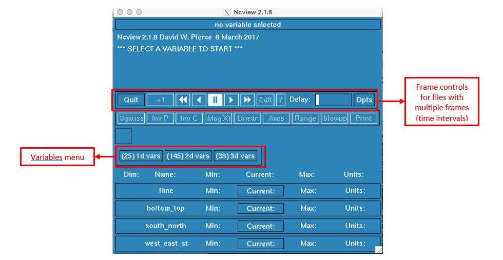
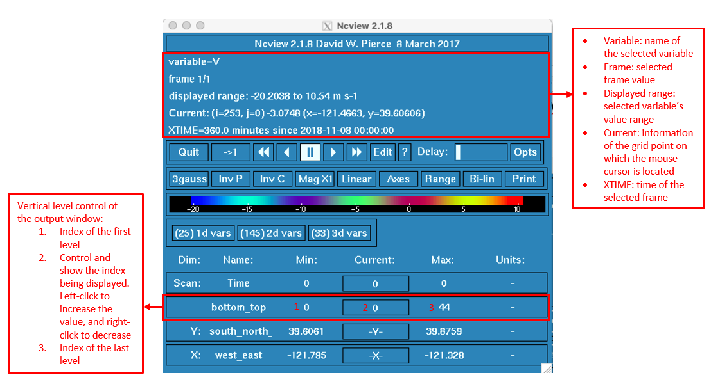
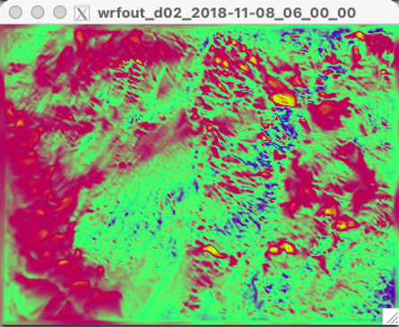
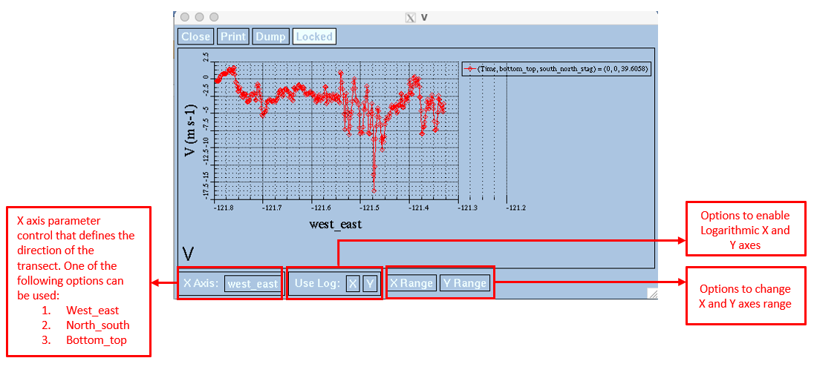

.. _visualization:

=============
Visualization
=============

.. _Ncview:

How to Visualize the Results Using Ncview
-----------------------------------------

.. raw:: html

   <a href="http://cirrus.ucsd.edu/~pierce/software/ncview/index.html" target="_blank">Ncview</a> is simple yet powerful visual browser to open and view netCDF files. This software is useful to check and view the input and output files of WRF-Fire.  

-----------------------

**How to Install Ncview on Linux**

Linux users can install Ncview from Advanced Package Tool (apt-get) using the following command:

::

   $ sudo apt-get install ncview

**How to Install Ncview on Mac**

.. raw:: html

   Mac users can install Ncview using <a href="https://brew.sh/" target="_blank">Homebrew</a>:   
  
::

   $ brew install ncview

**How to Use Ncview**

netCDF files can be opened in Ncview using the following command on both Linux and Mac:

::

   $ ncview (path to the netcdf file)/(netcdf file)

After the file is opened in Ncview, variables in the netCDF file can be viewed from variables menu (see below figure).
 

.. centered:: Ncview window after opening a netCDF file

After selecting the variable of interest, it will be shown in XY plane using color-filled contours.

 
.. centered:: Ncview window after choosing a variable

 
.. centered:: Output window of Ncview showing the value of the chosen variable in XY plane

Ncview can also plot 2D graphs of the selected variable. By left-clicking on a point of interest from the output window, Ncview generates a graph showing the value of the chosen variable with respect to a transect passing the chosen point.

.. centered:: Sample of Ncview generated 2D graph
